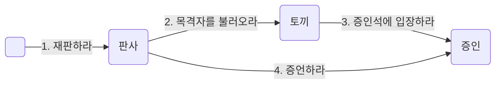

## 역할이 답이다
이제 지루한 말장난은 그만하고 핵심으로 들어가 보자. 지금 우리의 손 안에는 서로 다른 세 개의 재판 과장, 즉 세 개의 협력이 주어져 있다. 문제는 협력에 참여하는 등장인물들을 제외한 나머지 과정이 너무나도 유사해서 하나의 협력으로 다루고 싶다는 것이다.

방법은 간단하다. 재판이라는 협력 과정 속에서 하트 왕과 하트 여왕은 '판사'의 역할을 수행한다. 모자 장수와 요리사, 그리고 앨리스는 '증인'의 역할을 수행한다. 따라서 '판사'와 '증인'이라는 역할을 사용하면 세 가지 협력을 모두 포괄할 수 있는 하나의 협력으로 추상화할 수 있다.

- 누군가가 "판사"에게 재판을 요청함으로써 재판이 시작된다.
- "판사"는 하얀 토끼에게 증인을 부를 것을 요청한다.
- "판사"의 요청을 받은 토끼는 "증인"에게 증인석으로 입장할 것을 요청한다.
- "증인"은 증인석에 입장함으로써 토끼의 요청에 응답한다.
- "증인"의 입장은 연쇄적으로 토끼에 대한 "판사"의 요청에 대한 응답이기도 하다.
- 이제 "판사"는 "증인"에게 증언할 것을 요청한다.
- "증인"은 자신이 알고 있는 내용을 증언함으로써 "판사"의 요청에 응답한다.

역할은 협력 내에서 다른 객체로 대체할 수 있음을 나타내는 일종의 표식이다. 협력 안에서 역할은 "이 자리는 해당 역할을 수행할 수 있는 어떤 객체라도 대신할 수 있습니다"라고 말하는 것과 같다.

앞의 협력에서 '판사'라고 적혀 있는 자리는 하트 왕과 하트 여왕이 대신할 수 있으며, '증인'이라고 적혀 있는 자리는 모자 장수, 요리사, 앨리스가 대신할 수 있다. 정확하게 말해서 이제 이 협력에 참여할 수 있는 객체를 굳이 하트 왕이나 하트 여왕, 모자 장수, 요리사, 앨리스로 제한할 필요가 없다. 역할을 이용해 협력을 추상화했기 대문에 '판사'나 '증인'의 역할을 수행할 수 있는 어떤 객체라도 협력에 참여할 수 있는 것이다.

그렇다면 어떤 객체라도 '판사'나 '증인'의 역할을 대체할 수 있을까? 물론 그렇지는 않다. 역할을 대체하기 위해서는 각 역할이 수신할 수 있는 메시지를 동일한 방식으로 이해해야 한다. 하트 왕이 '판사'의 역할을 수행할 수 있는 이유는 '판사'가 수신할 수 있는 '재판하라'라는 메시지를 동일하게 이해하고 처리할 수 있기 때문이다. 모자 장수를 '증인'이라고 부를 수 있는 이유 역시 '증인석에 입장하라'와 '증언하라'라는 메시지를 이해할 수 있기 때문이다. 따라서 역할을 대체할 수 있는 객체는 동일한 메시지를 이해할 수 있는 객체로 한정된다.

앞에서 메시지가 책임을 의미한다고 했던 것을 기억하라. 결국 동일한 역할을 수행할 수 있다는 것은 해당 객체들이 협력 내에서 동일한 책임의 집합을 수행할 수 있다는 것을 의미한다. 동일한 역할을 수행하는 객체들이 동일한 메시지를 수신할 수 있기 때문에 동일한 책임을 수행할 수 있다는 것은 매우 중요한 개념이다. 이 개념을 제대로 이해해야만 객체지향이 제공하는 많은 장점을 누릴 수 있다.

요약하면 역할의 개념을 사용하면 유사한 협력을 추상화해서 인지 과부하를 줄일 수 있다. 또한 다양한 객체들이 협력에 참여할 수 있기 때문에 협력이 좀 더 유연해지며 다양한 객체드이 동일한 협력에 참여할 수 있기 때문에 재사용성이 높아진다. 역할은 객체지향 설계의 단순성, 유연성, 재사용성을 뒷받침하는 핵심 개념이다.