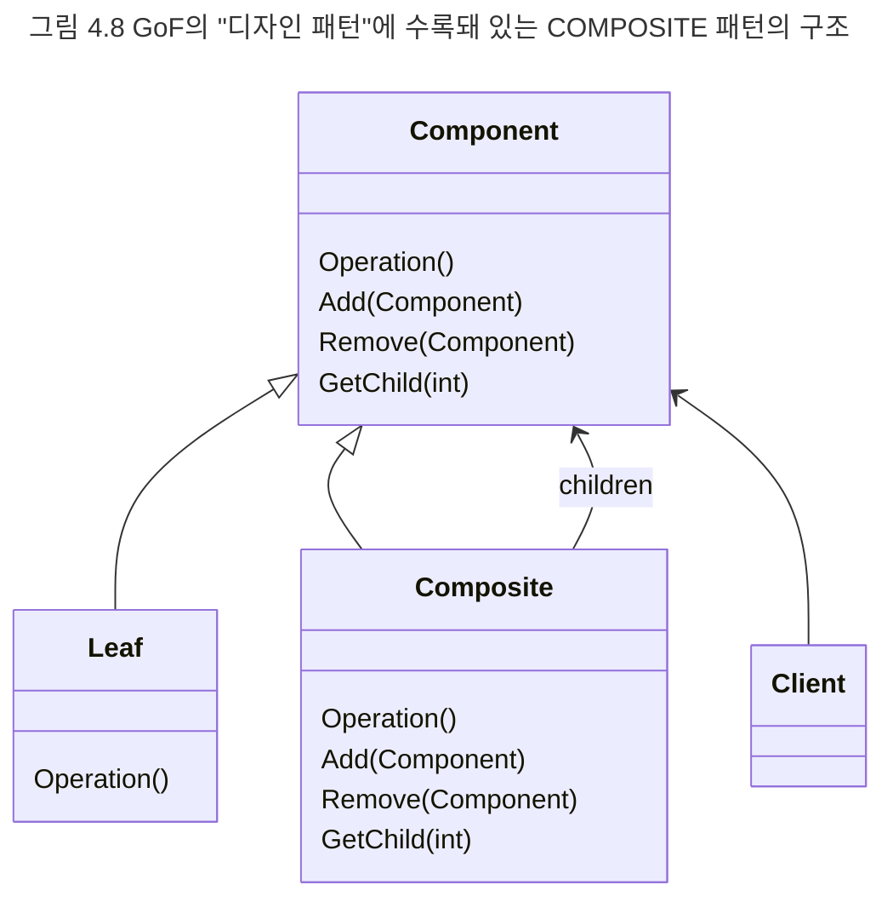

## 디자인 패턴
책임-주도 설계는 객체의 역할, 책임, 협력을 고안하기 위한 방법과 절차를 제시한다. 반면 디자인 패턴은 책임-주도 설계의 결과를 표현한다. 패턴은 모법이 되는 설계다. 앨리스터 코오번에 따르면 효과적으로 일하는 사람들의 한 가지 특징은 아무것도 없는 상태에서 작업을 시작하지 않고 이전의 훌륭한 결과물을 모방하고 약간의 수정을 거쳐 원하는 결과물을 만들어 낸다는 것이다. 패턴은 특정한 상황에서 설계를 돕기 위해 모방하고 수정할 수 있는 과거의 설계 경험이다.

일반적으로 디자인 패턴은 반복적으로 발생하는 문제와 그 문제에 대한 해법의 쌍으로 정의된다. 패턴은 해결하려고 하는 문제가 무엇인지를 명확하게 서술하고, 패턴을 적용할 수 있는 상황과 적용할 수 없는 상황을 함께 설명한다. 패턴은 반복해서 일어나는 특정한 상황에서 어떤 설계가 왜 더 효과적인지에 대한 이유를 설명한다. 디자인 패턴과 관련된 가장 유명한 패턴은 GOF의 "디자인 패턴"으로, 23개의 디자인 패턴들을 상세하게 정리해 놓았다.

디자인 패턴의 한 가지 예로 COMPOSITE 패턴을 살펴보자. COMPOSITE 패턴은 전체와 부분을 하나의 단위로 추상화해야 하는 경우에 사용할 수 있는 패턴이다. 윈도우 탐색기의 경우 개별적인 파일 단위로 경로를 변경할 수도 있지만 폴더의 경로를 변경함으로써 폴더 안에 포함된 모든 파일의 경로를 한 번에 변경할 수도 있다. 윈도우 탐색기를 사용하는 사용자의 관점에서 대상이 파일인지 폴더인지는 상관이 없다는 점에 주목하라. 사용자는 단지 대상을 선택한 후 경로를 바꾸기만 하면 된다. COMPOSITE 패턴은 이처럼 클라이언트 입장에서 메시지 수신자가 부분(파일)인지 전체(폴더)인지에 상관 없이 동일한 메시지(경로 변경)를 이용해 동일한 방식으로 대상과 상호작용하고 싶을 때 사용할 수 있는 패턴이다.

GOF의 "디자인 패턴"의 COMPOSITE 패턴 부분을 펼쳐보면 그림 4.8과 같이 패턴의 구조를 설명해 놓은 그림을 찾을 수 있을 것이다. 여기서 말하고 싶은 것은 COMPOSITE 패턴의 세부적인 구조가 아니다. 중요한 것은 그림에 표현돼 있는 구성 요소가 클래스와 메서드가 아니라 '협력'에 참여하는 '역할'과 '책임'이라는 사실이다. Component는 클라이언트와 협력할 수 있는 공용 인터페이스를 정의하는 역할을 수행한다. Leaf 역할은 공용 인터페이스에 대한 오퍼레이션 호출에 응답할 수 있는 기본적인 행위를 구현한다. Composite은 외부로부터 부분에 대한 세부 사항을 감추고 포함된 부분을 하나의 단위로 행동하는 역할이다. Client는 Component에게 메시지를 요청함으로써 협력하는 임의의 역할이다. Component의 역할은 다른 Component를 추가하거나(Add()), 제거하거나(Remove()), 포함된 Component를 반환해야 하는(GetChild()) 책임을 가진다.

COMPOSITE 패턴은 부분과 전체가 투명하고 동일한 인터페이스를 제공해야 한다는 제약하에서 식별된 역할, 책임, 협력을 제공하는 한 가지 설계 예제다. 따라서 디자인 패턴은 유사한 상황에서 반복적으로 적용할 수 있는 책임-주도 설계의 결과물이라고 할 수 있다.

Component, Leaf, Composite이 역할이라는 사실은 살제로 구현 시에는 다양한 방식으로 역할을 구현할 수 있다는 사실을 암시한다. 심지어 하나의객체가 세 가지 역할을 모두 수행할 수도 있다. 조슈아 케리에브스키는 "패턴을 활용한 리팩터링"에서 하나의 클래스가 세 가지 역할을 모두 수행하는 COMPOSITE 패턴의 예를 소개하고 있다.

디자인 패턴은 공통으로 사용할 수 있는 역할, 책임, 협력의 템플릿이다. 만약 특정한 상황에 적용 가능한 디자인 패턴을 잘 알고 있다면 책임-주도 설계의 절차를 순차적으로 따르지 않고도 시스템 안에 구현할 객체들의 역할과 책임, 협력 관계를 빠르고 손쉽게 포착할 수 있을 것이다. 딪