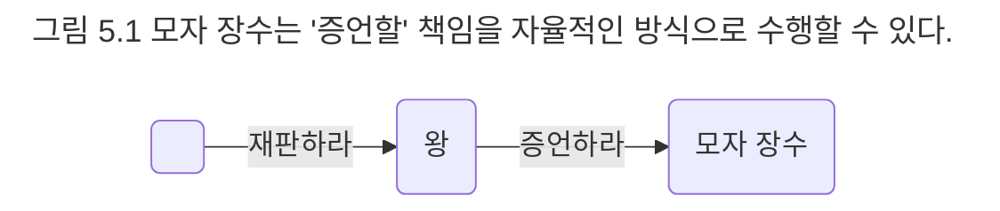
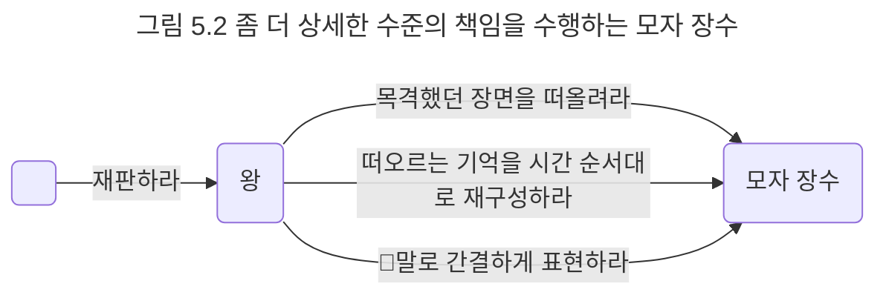

## 자신의 의지에 따라 증언할 수 있는 자유
객체가 책임을 자율적으로 수행하기 위해서는 객체에게 할당되는 책임이 자율적이어야 한다. 책임이 자율적이지 않다면 객체가 아무리 발버둥친다고 하더라도 자율적으로 책임을 수행하기 어렵다.

이해를 돕기 위해 앨리스의 재판 이야기로 돌아가보자. 그림 5.1에 그려진 것처럼 왕은 목격자인 모자 장수에게 '증언하라'는 요청을 전송한다. 모자 장수가 재판이라는 협력에 참여하기 위해서는 왕의 요청을 적절하게 처리한 후 응답해야 한다. 요청은 수신자의 책임을 암시하므로 모자 장수는 재판이라는 협력에 참여하기 위해 '증언할' 책임을 진다.

왕은 모자 장수가 '증언하라'ㄹ라는 자신의 요청에 반응해 책임을 완수할 수만 있다면 어떤 방법으로 증언하는지에 관해서는 신경을 쓰지 않는다. 모자 장수는 왕의 요청을 받아야만 책임을 수행하기 시작하겠지만 증언 방식이나 증언에 필요한 자료는 스스로의 의지와 판단에 따라 자유롭게 선택할 수 있다.

이번에는 그림 5.2와 같이 왕이 모자 장수가 증언하는 데 필요한 행동들을 좀 더 상세하게 요청한다고 가정해보자. 이 경우 모자 장수는 왕과 협력하기 위해 먼저 '목격했던 장면을 떠올리고', '떠올리는 기억을 시간 순서대로 재구성'한 후, '말로 간결하게 표현'해야 하는 책임들을 떠안게 된다.

그림 5.1과 그림 5.2는 협력의 결과로 모자 장수가 왕의 요청을 받아 자신이 목격한 것을 증언하게 된다는 점에서는 동일하다. 하지만 모자 장수에게 주어진 권한에는 큰 차이가 있다.

첫 번째 협력에서 모자 장수는 왕에게 증언할 책임은 있지만 증언을 위한 구체적인 방법이나 절차에 대해서는 최대한의 자유를 누린다. 모자 장수가 자신의 기억력이 꽤 정확하다고 생각한다면 기억을 토대로 목격한 것을 설명할 것이다. 평소 기억력이 나빠 모든 내용을 꼼꼼하게 기록하는 성격이라면 기록된 내용을 참고해서 증언할 수 있을 것이다. 말주변이 없어 조리 있게 설명하기 어렵다면 증언할 내용을 문서로 작성해 제출할 수도 있을 것이다.

중요한 것은 왕의 입장에서 모자 장수가 어떤 방법으로 증언하는지는 중요하지 않다는 것이다. 왕은 단지 모자 장수가 증언하기를 바랄 뿐이다. 증언이라는 책임만 완수할 수 있다면 나머지 구체적인 방법이나 절차는 모자 장수가 자유롭게 선택하도록 허용한다. 다라서 모자 장수는 최종적으로 왕이 만족할 만한 수준으로 증언할 수만 있다면 그 밖의 세부 사항에 대해서는 무한대에 가까운 자율권을 누릴 수 있다.

두 번째 협력을 살펴보자. 두 번째 협력에서 왕은 '목격했던 장면을 떠올려라', '떠오르는 기억을 시간 순서대로 재구성하라', '말로 간결하게 표현하라'와 같이 좀 더 상세한 수준으로 요청한다. 모자 장수는 첫 번째 협력에서와 마찬가지로 이 요청들을 차례대로 처리해야 하는 책임을 지고 있다. 따라서 모자 장수에게는 목격했던 장면을 떠올리고, 떠오