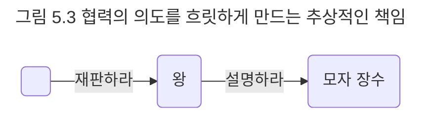

## 너무 추상적인 책임
포괄적이고 추상적인 책임을 선택한다고 해서 무조건 좋은 것은 아니다. 책임이 수행 방법을 제한할 정도로 너무 구체적인 것도 문제지만 협력의 의도를 명확하게 표현하지 못할 정도로 추상적인 것 역시 문제다.

그림 5.3에서 모자 장수는 왕과 협력하기 위해 '설명하라'라는 책임을 수행한다. 여기서 모자 장수는 무엇을 설명해야 하는가? 자신의 일생에 대해 설명해야 하는가? 오늘 모자를 얼마나 팔았는지에 관해 설명해야 하는가? 아니면 평소에 왕을 얼마나 존경해 왔는지 설명해야 하는가?

추상적이고 포괄적인 책임은 협력을 좀 더 다양한 환경에서 재사용할 수 있도록 유연성이라는 축복을 내려준다. 그러나 책임은 협력에 참여하는 의도를 명확하게 설명할 수 있는 수준 안에서 추상적이어야 한다. '증언하라'라는 책임이 훌륭한 책임인 이유는 모자 장수의 자율성을 보장할 수 있을 정도로 충분히 추상적인 동시에 협력의 의도를 뚜렷하게 표현할 수 있을 정도로 충분히 구체적이기 때문이다.

어떤 책임이 자율적인지를 판단하는 기준은 문맥에 따라 다르다는 사실에 유의하라. 재판이라는 협력 안에서는 '증언하라'라는 책임이 모자 장수의 자율권을 보장하는 가장 적절한 수준의 책임이지만 다른 상황에서는 오히려 '설명하라'라는 책임이 자율권을 보장하는 최선의 선택이 될 수 있다. 어떤 책임이 가장 적절한가는 설계 중인 협력이 무엇인가에 따라 달라진다. 이런 모호함이 객체지향 설계를 난해하면서도 매력적인 예술로 만드는 이유다.

성급한 일반화의 오류를 피하고 현재의 문맥에 가장 적합한 책임을 선택할 수 있는 날카로운 안목을 기르기 바란다.