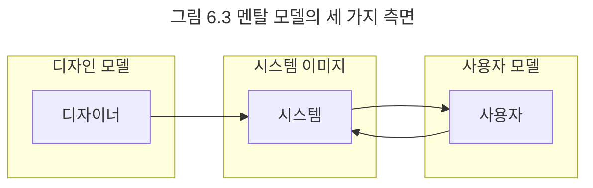

## 도메인 모델
모든 소프트웨어는 사용자의 필요성을 충족시키기 위해 존재한다. 병원에서는 모든 환자의 진료 기록을 보관하고 분석하기 위해 소프트웨어를 사용한다. 은행에서는 고객의 소중한 자산을 관리하고 보호하기 위해 소프트웨어를 사용한다. 무료한 시간을 달래기 위해 사람들은 게임 소프트웨어에 열중한다. 소프트웨어를 사용하는 사람들은 자신이 관심을 가지고 있는 특정한 분야의 문제를 해결하기 위해 소프트웨어를 사용한다. 이처럼 사용자가 프로그램을 사용하는 대상 분야를 도메인이라고 한다.

도메인 모델에서 모델이란 대상을 단순화해서 표현한 것이다. 모델은 지식을 선택적으로 단순화하고 의식적으로 구조화한 형태다. 모델은 복잡성의 바다에서 길을 잃지 않고 중요한 문제에 집중할 수 있도록 필요한 지식만 재구성한 것이다. 즉, 대상을 추상화하고 단순화한 것이다. 모델을 사용하면 현재의 문제와 관련된 측면은 추상화하고 그 밖의 관련 없는 세부 사항에 대해서는 무시할 수 있다. 모델은 복잡성을 관리하기 위해 사용하는 기본적인 도구다.

도메인과 모델의 정의를 연결하면 도메인 모델을 쉽게 정의할 수 있다. 도메인 모델이란 사용자가 프로그램을 사용하는 대상 영역에 관한 지식을 선택적으로 단순화하고 의식적으로 구조화한 형태다. 도메인 모델은 소프트웨어가 목적하는 영역 내의 개념과 개념 간의 관계, 다양한 규칙이나 제약 등을 주의 깊게 추상화한 것이다. 도메인 모델은 소프트웨어 개발과 관련된 이해관계자들이 도메인에 대해 생각하는 관점이다.

은행 업무에 종사하는 사람들은 은행 도메인을 고객과 계좌 사이의 돈의 흐름으로 이해할 것이다. 중고 자동차 판매상은 구매되는 자동차와 판매되는 자동차의 교환으로 자동차 도메인을 바라볼 것이다. 게임 플레이어들은 게임 도메인을 캐릭터와 몬스터, 그리고 몬스터가 떨구는 아이템 간의 관계로 파악한다. 프로그래밍에 종사하는 사람들은 프로그래밍 도메인을 커피를 입력으로 코드를 출력하는 함수로 파악한다. 소프트웨어의 도메인이 무엇이건 상관없이 그곳에는 항상 도메인과 관련된 사람들이 도메인을 바라보는 모델이 존재한다.

도메인 모델은 단순히 다이어그램이 아니다. 도메인 모델은 이해관계자들이 바라보는 멘탈 모델이다. 멘탈 모델이란 사람들이 자기 자신, 다른 사람, 환경, 자신이 상호작용하는 사물들에 대해 갖는 모형이다. 사람들은 세상에 존재하는 현상을 이해하고 현상에 반응하기 위해 자신의 마음 속에 멘탈 모델을 구축한다. 소프트웨어 사용자들 역시 도메인에 존재하는 현상을 이해하고 현상에 반응하기 위해 도메인과 관련된 멘탈 모델을 형성한다.

도널드 노먼은 제품을 설계할 때 제품에 관한 모든 것이 사용자들이 제품에 대해 가지고 있는 멘탈 모델과 정확하게 일치해야 한다고 주장한다. 사용자들은 자신의 멘탈 모델과 유사한 방식으로 제품이 반응하고 움직일 것이라고 기대하기 때문에 훌륭한 디자인이란 사용자가 예상하는 방식에 따라 정확하게 반응하는 제품을 만드는 것이다.

노먼은 그림 6.3과 같이 멘탈 모델을 사용자 모델, 디자인 모델, 시스템 이미지의 세 가지로 구분한다. 사용자 모델은 사용자가 제품에 대해 가지고 있는 개념들의 모습이다. 디자인 모델은 설계자가 마음 속에 갖고 있는 시스템에 대한 개념화다. 시스템 이미지는 최종 제품이다.

사용자 모델과 디자인 모델이 동일하다면 이상적이겠지만 사용자와 설계자는 직접적으로 상호작용할 수 없으며 단지 최종 제품인 시스템 그 자체를 통해서만 의사소통할 수 있다. 따라서 설계자는 디자인 모델을 기반으로 만든 시스템 이미지가 사용자 모델을 정확하게 반영하도록 노력해야 한다.

도메인 모델은 도메인에 대한 사용자 모델, 디자인 모델, 시스템 이미지를 포괄하도록 추상화한 소프트웨어 모델이다. 따라서 도메인 모델은 소프트웨어에 대한 멘탈 모델이다.