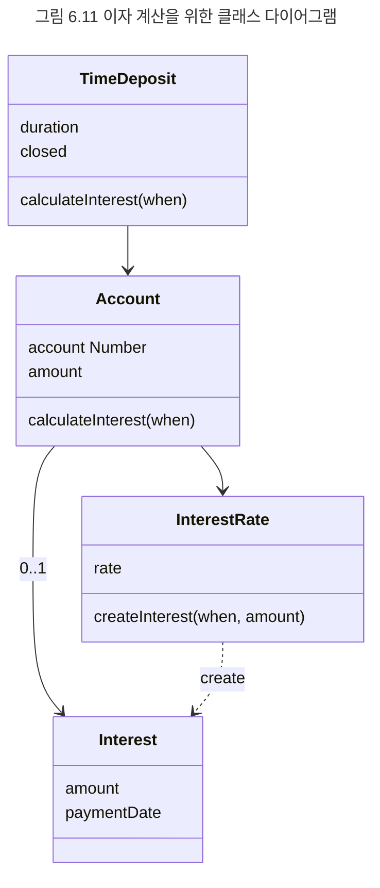

## 도메인 모델, 유스케이스, 그리고 책임-주도 설계
불안정한 기능을 안정적인 구조 안에 담음으로써 변경에 대한 파급효과를 최소화하는 것은 훌륭한 객체지향 설계자가 갖춰야 할 기본적인 설계 능력이다. 도메인 모델은 안정적인 구조를 개념화하기 위해, 유스케이스는 불안정한 기능을 서술하기 위해 가장 일반적으로 사용되는 도구다. 변경에 유연한 소프트웨어를 만들기 위해서는 유스케이스에 정리된 시스템의 기능을 도메인 모델을 기반으로 한 객체들의 책임으로 분배해야 한다.

객체지향 패러다임은 모든 것이 객체라는 사상에서 출발한다. 따라서 유스케이스에 명시된 기능을 구현하는 프로그래머는 시스템을 사용자로부터 전송된 메시지를 수행하기 위해 책임을 수행하는 거대한 자율적인 객체로 본다. 시스템은 사용자와 만나는 경계에서 사용자의 목표를 만족시키기 위해 사용자와의 협력에 참여하는 커다란 객체다. 사용자에게 시스템이 수행하기로 약속한 기능은 결국 시스템의 책임으로 볼 수 있다. 사용자의 관점에서 객체는 자신이 전송한 메시지에 응답하는 데 필요한 책임을 수행하는 일종의 객체다. 

시스템이라는 객체 안에는 더 작은 규모의 객체가 포함될 수 있다. 이제 시스템이 수행해야 하는 커다란 규모의 책임은 시스템 안에 살아가는 더 작은 크기의 객체들의 협력을 통해 구현될 수 있다.

사실 앞에서 살펴본 책임-주도 설계는 이 지점부터 적용된다. 지금까지는 시스템이나 사용자에게 제공할 기능이 있다는 가정하에 객체들 간의 협력을 설계했지만 사실 협력의 출발을 장식하는 첫 번째 메시지는 시스템의 기능을 시스템의 책임으로 바꾼 후 얻어진 것이다.

시스템에 할당된 커다란 책임은 이제 시스템 안의 작은 규모의 객체들이 수행해야 하는 더 작은 규모의 책임으로 세분화된다. 그렇다면 어떤 객체를 선택할 것인가? 이 시점에 도메인 모델이 무대에 등장한다. 우리는 도메인 모델에 포함된 개념을 은유하는 소프트웨어 객체를 선택해야 한다. 이것은 소프트웨어와 코드 사이의 표현적 차이를 줄이는 첫걸음이다.

협력을 완성하는 데 필요한 메시지를 식별하면서 객체들에게 책임을 할당해 나간다. 마지막으로 협력에 참여하는 객체를 구현하기 위해 클래스를 추가하고 속성과 함께 메서드를 구현하면 시스템의 기능이 완성된 것이다. 이제 코드는 불안정한 기능을 수용할 수 있는 안정적인 구조에 기반한다.

```text
객체 설계는 가끔 다음과 같이 표현되기도 한다.

요구사항들을 식별하고 도메인 모델을 생성한 후, 소프트웨어 클래스에 메서드들을 추가하고, 요구사항을 충족시키기 위해 객체들 간의 메시지 전송을 정의하라.
```

유스케이스는 사용자에게 제공할 기능을 시스템의 책임으로 보게 함으로써 객체 간의 안정적인 구조에 책임을 분배할 수 있는 출발점을 제공한다. 도메인 모델은 기능을 수용하기 위해 은유할 수 있는 안정적인 구조를 제공한다. 책임-주도 설계는 유스케이스로부터 첫 번째 메시지와 사용자가 달성하려는 목표를, 도메인 모델로부터 기능을 수용할 수 있는 안정적인 구조를 제공받아 실제로 동작하는 객체들의 협력 공동체를 창조한다.

책임-주도 설계 방법은 시스템의 기능을 역할과 책임을 수행하는 객체들의 협력 관게로 바라보게 함으로써 두 가지 기본 재료인 유스케이스와 도메인 모델을 통합한다. 물론 책임-주도 설계를 위해 유스케이스와 도메인 모델이 반드시 필요한 것은 아니고 유스케이스와 도메인 모델이 책임-주도 설계에서만 사용되는 것은 아니다. 여기서 중요한 것은 견고한 객체지향 애플리케이션을 개발하기 위해서는 사용자의 관점에서 시스템의 기능을 명시하고, 사용자와 설계자가 공유하는 안정적인 구조를 기반으로 기능을 책임으로 변환하는 체계적인 절차를 따라야 한다는 것이다.

**예제**
이자 계산 기능 구현
정기 예금을 중도 해지할 경우 지급받을 수 있는 이자액을 계산하는 기능을 구현하려면 유스케이스에 명시된 시스템의 행위를 객체의 책임으로 분배해야 한다. 여기서는 그림 6.6의 유스케이스에 명시된 다음 두 개의 문장과 관련된 기능을 소프트웨어 기능으로 구현해 보자.

```text
3. 예금주가 금일 기준으로 예금을 해지할 경우 지급받을 수 있는 이자 계산을 요청한다.
4. 시스템은 중도 해지 시 지급받을 수 있는 이자를 계산한 후 결과를 사용자에게 제공한다.
```

유스케이스는 시스템이 중도 해지 이자액을 계산하는 기능을 제공해야 한다고 속삭이고 있다. 프로그래머는 기능이라는 단어를 머릿속에서 책임이라는 단어로 대체한다. 그리고 시스템이 '중도 해지 이자액을 계산하라'라는 메시지를 받는 거대한 객체라고 가정한다.

시스템에 할당된 커다란 책임은 이제 시스템 안에서 실행될 소프트웨어 객체들의 협력으로 구현돼야 한다. 여기서부터 앞에서 설명한 책임-주도 설계 방법이 등장한다. 우리는 메시지를 받을 객체를 선택하고, 그 객체가 다른 객체에 전송할 메시지를 식별한 후, 다시 그 메시지를 받을 객체를 선택함으로써 자율적인 객체들의 협력 관게를 창조한다.

그렇다면 할당받을 객체들은 어디서부터 가져와야 하는가? 안정적인 도메인 모델을 기반으로 해야 한다. 그림 6.5의 도메인 모델은 이자 계산이라는 시스템의 책임을 분배할 객체 구조에 대한 힌트를 제공한다. 따라서 이자 계산 협력에 참여하는 객체들은 그림 6.5의 도메인 모델에 기술된 개념 중 적절한 것을 선택해야 한다.

도메인 모델을 기반으로 이자 계산이라는 시스템 책임을 아래와 같이 책임으로 분할하고 객체들에게 할당함으로써 협력하는 객체들의 공동체를 형성할 수 있다.

- 정기예금은 해지 일자를 전달받아 이자 계산을 시작하는 책임을 맡는다. 정기예금은 해당 일자가 약정 기간에 포함되는지 확인한 후 포함될 경우 계좌에게 이자 계산을 요청한다.
- 계좌는 예금액과 해지 일자를 이자율에게 전달해서 이자를 계산하게 한다.
- 이자율은 전달받은 예금액과 해지 일자를 이용해 이자액을 계산한 후 이자액을 포함하는 이자를 생성해서 반환한다.

이자 계산에 필요한 객체와 책임이 식별됐으므로 객체를 클래스로, 책임을 클래스의 메서드로 변환함으로써 이자 계산 기능을 구현할 수 있다. 그림 6.11은 이자 계산을 위한 클래스 구조를 나타낸 것이다. 도메인 모델의 속성을 클래스의 인스턴스 변수로, 협력 안에서의 책임을 클래스의 메서드로 변환했음에 주목하라. 실제 소프트웨어를 구현할 경우 도메인 모델에서 클래스로의 변환이 이처럼 단순하지는 않지만 이 예제는 시스템의 기능을 클래스 간의 정적인 관계로 구현하는 과정에 대한 기본적인 통찰을 제공해 줄 것이다.



도메인 모델에 명시된 정기예금이나 계좌와 같은 개념을 스스로 상태와 행위를 관리하는 자율적인 객체로 간주한다는 사실에 주목하라. 실세계에서는 수동적인 존재라고 하더라도 소프트웨어 객체로 구현될 때는 스스로 판단하고 행동하는 자율적인 존재로 변한다.

각 객체는 자신의 책임을 완수하는 데 필요한 정보나 서비스가 필요한 경우 이를 제공할 수 있는 다른 객체에게 책임을 요청한다. 따라서 시스템의 기능은 역할과 책임을 수행하는 객체들의 협력 관계를 통해 구현된다.

객체의 이름은 도메인 모델에 포함된 개념으로부터 차용하고, 책임은 도메인 모델에 정의한 개념의 정의에 부합되도록 할당한다. 예를 들어, 이자를 계산하는 책임을 가진 객체는 이자율이 될 것이며, 이자는 이자율에 의해 생성될 것이다. 왜 이자를 계산하는 책임을 이자율 객체에 할당하는가? 책임 할당의 기본 원칙은 책임을 수행하는 데 필요한 정보를 가진 객체에게 그 책임을 할당하는 것이기 때문이다. 이것은 관련된 상태와 행동을 함께 캡슐화하는 자율적인 객체를 낳는다.

유스케이스에서 출발해 객체들의 협력으로 이어지는 일련의 흐름은 객체 안에 다른 객체를 포함하는 재귀적 합성이라는 객체지향의 기본 개념을 잘 보여준다. 객체지향은 모든 것을 객체로 바라본다. 큰 객체가 더 작은 객체로 나눠질 수 있다는 사실만 제외하면 그것들 사이에 차이는 없다. 크기와 상관없이 모든 객체는 메시지를 전송하거나 수신할 수 있고 메시지에 응답하기 위해 자율적으로 메서드를 선택할 수 있다. 객체에 대한 재귀는 객체지향의 개념을 모든 추상화 수준에서 적용 가능하게 하는 동시에 객체지향 패러다임을 어떤 곳에서든 일관성 있게 적용할 수 있게 한다.

스몰토크 언어를 설계한 객체지향의 선구자인 앨런 케이는 시스템을 자율적인 객체로 바라보고 더 작은 객체로 분할하는 방식의 장점에 대해 다음과 같이 설명한다.

```text
스몰토크의 설계 - 그리고 실제 모습 - 는 우리가 설명할 수 있는 모든 것이 상태와 처리 과정을 내부로 은닉하는 행위적인 빌딩블록의 재귀적인 합성으로 표현할 수 있으며, 메시지의 교환을 통해서만 이 빌딩블록들을 처리할 수 있다는 통찰에서 기인한다. ... 컴퓨터 측면에서 스몰토크는 컴퓨터 자체에 대한 개념적 재귀다. 컴퓨터를 전체보다 덜 강한 개별적인 요소 - 프로그래밍 언어의 일상적인 부속품인 자료 구조, 프로시져, 함수 - 로 분해하는 대신 각 스몰토크 객체는 컴퓨터의 전체적인 가능성을 기반으로 한 재귀다. ... 재귀적 설계의 기본 원칙은 부분이 전체와 동일한 힘을 갖게 만드는 것이다. 처음에 나는 전체를 완전한 하나의 컴퓨터로 간주했고, 사람들이 왜 컴퓨터를 자료 구조와 프로시저라는 더 약한 개념으로 분할하려고 하는지 그 이유가 궁금했다. 시분할이 시작한 것처럼 왜 컴퓨터를 더 작은 컴퓨터로 나누지 않는가?
```

