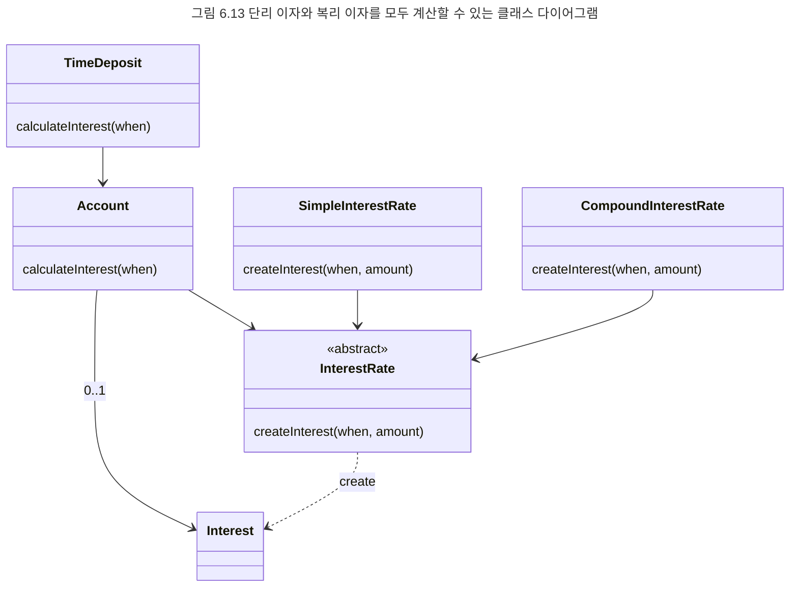
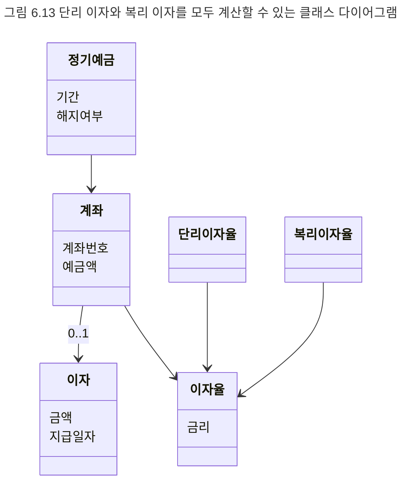

## 기능 변경을 흡수하는 안정적인 구조
앞에서 설명한 것처럼 도메인 모델을 기반으로 객체 구조를 설계하는 이유는 도메인 모델이 안정적이기 때문이다. 도메인 모델이 안정적인 이유는 도메인 모델을 구성하는 요소가 다음과 같은 특징을 띠기 때문이다. 

- 도메인 모델을 구성하는 개념은 비즈니스가 없어지거나 완전히 개편되지 않는 한 안정적으로 유지된다. 정기예금 도메인에서 정기예금과 계좌, 이자율, 이자란 개념은 정기예금이란 금융상품이 없어지거나 완전히 개편되지 않는 한 안정적으로 유지되는 개념이다.
- 도메인 모델을 구성하는 개념 간의 관계는 비즈니스 규칙을 기반으로 하기 때문에 비즈니스 정책이 크게 변경되지 않는 한 안정적으로 유지된다. 정기예금 도메인에서 이자는 정기예금이 만기가 되거나 중도 해지를 하는 경우에 한해서 단 한 번 지급된다. 따라서 계좌와 이자 간의 0..1 관계는 이와 같은 핵심적인 비즈니스 규칙이 변경되지 않는 한 동일하게 유지될 것이다.

도메인 모델의 이같은 특징은 도메인 모델을 중심으로 객체 구조를 설계하고 유스케이스의 기능을 객체의 책임으로 분배하는 기본적인 객체지향 설계 방식의 유연함을 잘 보여 준다. 비즈니스 정책이나 규칙이 크게 변경되지 않는 한 시스템의 기능이 변경되더라도 객체 간의 관게는 일정하게 유지된다. 기능적인 요구사항이 변경될 경우 책임과 객체 간의 대응 관계만 수정될 뿐이다. 이것은 변경에 대한 파급효과를 최소화하고 요구사항 변경에 유연하게 대응할 수 있는 시스템을 구축할 수 있게 한다.

이제 이자를 계산하는 방식이 변할 때 시스템에 어떤 일이 발생하는지 살펴보자.

**예제**
이자 계산 기능의 변경
은행은 정기예금의 경우 원금에 대해서만 이자를 지급하는 기존의 단리 이자 방식뿐만 아니라 이자에 대해서도 이자를 지급하는 복리 이자 방식을 추가하기로 결정했다. 따라서 시스템은 계좌의 이자 지급 방식에 따라 적절한 방식으로 이자를 계산할 수 있어야 한다.

여기서 어려운 점은 이자를 계산하기 위해 단리 이자 방식과 복리 이자 방식을 유연하게 선택할 수 있어야 한다는 것이다. 경험 많은 설계자들은 이 경우 단리 이자 규칙과 복리 이자 규칙이 계좌 이자 계산을 위한 STRATEGY 패턴의 한 예라는 것을 쉽게 간파할 수 있을 것이다.

그림 6.13은 기존의 단리 이자만을 계산하던 `InterestRate` 클래스를 추상 클래스로 변경하고 단리 이자를 계산하는 `SimpleInterest`와 복리 이자를 계산하는 `CompoundInterest`가 `InterestRate`를 상속받게 한 것이다. 다이어그램을 간략하게 표현하기 위해 클래스의 인스턴스 변수는 생략했다.

`InterestRate`에 정의된 `createInterest()` 메시지를 수신할 경우 객체의 타입에 따라 실행될 메서드가 선택될 수 있게 한다. 즉, `createInterest()` 메시지를 수신하는 객체의 타입이 `SimpleInterest`일 경우 단리 이자를 계산하는 `SimpleInterest`의 `createInterest()` 메서드가 실행되고 수신하는 객체의 타입이 `CompoundInterest`일 경우 복리 이자를 계산하는 `CompoundInterest`의 `createInterest()` 메서드가 실행된다. 이와 같이 인터페이스를 정의하는 추상 클래스와 인터페이스를 구현하는 구체적인 클래스 간의 상속 관계는 클래스 기반의 객체지향 언어에서 다형성을 구현하는 가장 기본적인 방법이다.

그림 6.13을 그림 6.11과 비교해 보라. 핵심적인 클래스와 클래스 간의 관계는 그대로 유지되고 있다는 것을 알 수 있다. 이처럼 이자 계산 기능이 변경되거나 추가돼도 대부분의 클래스 구조가 그대로 유지되는 이유는 도메인을 구성하는 기본적인 개념과 관계를 포함하는 도메인 모델을 기반으로 시스템의 기능을 대응시켰기 때문이다.

안정적인 도메인 모델을 기반으로 시스템의 기능을 구현할 경우 시스템의 기능이 변경되더라도 비즈니스의 핵심 정책이나 규칙이 변경되지 않는 한 전체적인 구조가 한 번에 흔들리지는 않는다. 이것이 일반적으로 객체지향이 기능의 변경에 대해 좀 더 유연하게 대응할 수 있는 패러다임이라고 일컬어지는 이유다.

객체지향의 가장 큰 장점은 도메인을 모델링하기 위한 기법과 도메인을 프로그래밍하기 위해 사용하는 기법이 동일하다는 점이다. 따라서 도메인 모델링에서 사용한 객체와 개념을 프로그래밍 설계에서의 객체와 클래스로 매끄럽게 변환할 수 있다. 앞에서 객체지향의 이 같은 특성을 연결완전성이라고 설명했다.

객체지향이 강력한 이유는 연결완전성의 역방향 역시 성립한다는 것이다. 즉, 코드의 변경으로부터 도메인 모델의 변경 사항을 유추할 수 있다. 이것은 객체지향 이전의 대부분의 개발 방법이 대응하지 못하고 쉽게 무너졌던 영역이다. 객체지향에서는 도메인 모델과 코드 모두 동일한 모델링 패러다임을 공유하기 때문에 코드의 수정이 곧 모델의 수정이 된다. 이처럼 모델에서 코드로의 매끄러운 흐름을 의미하는 연결완전성과 반대로 코드에서 모델로의 매끄러운 흐름을 의미하는 것을 가역성이라고 한다.

이자 계산 예제에서 그림 6.13과 같이 코드가 변경될 경우 이해관계자들은 변경된 코드로부터 자연스럽게 그림 6.14와 같은 개념적인 도메인 모델의 구조를 유추할 수 있다. 여기서 이야기하는 도메인 모델이 코드와 분리된 별도의 산출물이 아니라는 점에 유의하라.

도메인 모델은 문서나 다이어그램이 아니다. 도메인 모델은 사람들의 머릿속에 들어있는 공유된 멘탈 모델이다. 따라서 별도의 문서나 다이어그램을 가지고 있지 않더라도 사람들의 머릿속에 그림 6.14와 유사한 모델이 공유될 수 있다면 그것으로 충분하다. 사람들이 동일한 용어와 동일한 개념을 이용해 의사소통하고 코드로부터 도메인 모델을 유추할 수 있게 하는 것이 도메인 모델의 진정한 목표다.

안정적인 도메인 모델을 기반으로 시스템의 기능을 구현하라. 도메인 모델과 코드를 밀접하게 연관시키기 위해 노력하라. 그것이 유지보수하기 쉽고 유연한 객체지향 시스템을 만드는 첫걸음이 된다.