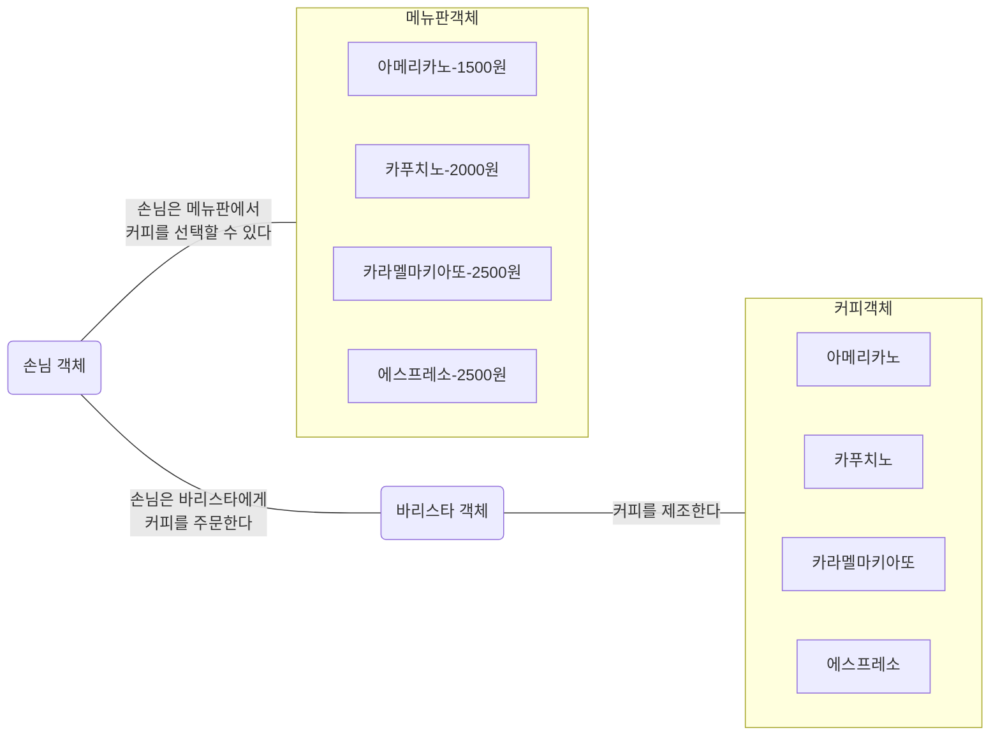
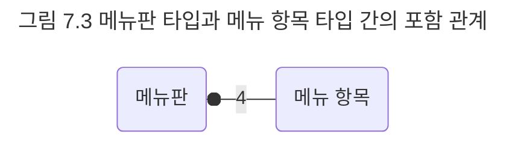
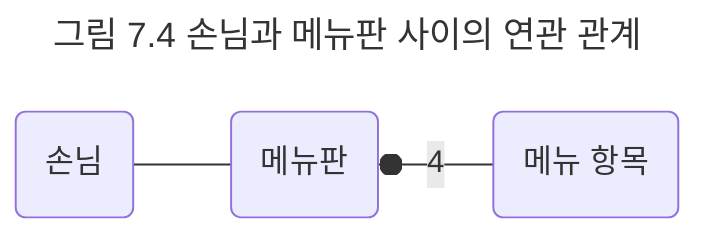
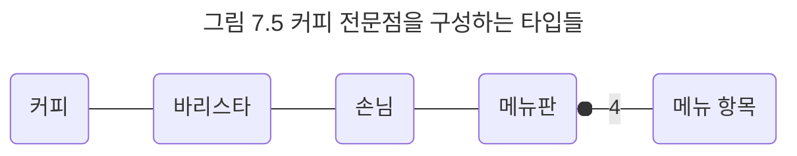

## 커피 전문점이라는 세상
개발에 들어가기 전에 먼저 커피 전문점을 구성하는 요소들에 관해 잠시나마 고민해 보는 것이 도움될 것이다. 객체지향 패러다임의 가장 중요한 도구는 객체이므로 커피 전문점을 객체들로 구성된 작은 세상으로 바라보자.

커피 전문점 안에는 메뉴판이 존재한다. 메뉴판에는 아메리카노, 카푸치노, 카라멜 마키아또, 에스프레소의 네 가지 커피 메뉴가 적혀 있다. 객체지향의 관점에서 메뉴판은 하나의 객체다. 메뉴판은 네 개의 메뉴 항목으로 구성돼 있는데 메뉴 항목들 역시 객체로 볼 수 있다. 따라서 메뉴판은 네 개의 메뉴 항목 객체들을 포함하는 객체라고 볼 수 있다. 

손님은 메뉴판을 보고 바리스타에게 원하는 커피를 주문한다. 객체의 관점에서 보면 손님 역시 하나의 객체다. 손님 객체는 메뉴판 객체 안에 적힌 메뉴 항목 객체들 중에서 자신이 원하는 메뉴 항목 객체 하나를 선택해 바리스타 객체에게 전달할 것이다.

바리스타는 주문을 받은 메뉴에 따라 적절한 커피를 제조한다. 바리스타가 제조할 수 있는 커피의 종류는 아메리카노, 카푸치노, 카라멜 마키아또, 에스프레소의 네 가지다. 바리스타는 자율적으로 커피를 제조하는 객체로 볼 수 있으며, 바리스타가 제조하는 커피 역시 메뉴판, 메뉴 항목, 바리스타와 구별되는 자신만의 경계를 가지므로 객체로 볼 수 있다.

종합해 보면 객체지향의 관점에서 커피 전문점이라는 도메인은 손님 객체, 메뉴 항목 객체, 메뉴판 객체, 바리스타 객체, 커피 객체로 구성된 작은 세상이다.



어떤 객체가 존재하는지 살펴봤으므로 이제는 객체들 간의 관계를 살펴볼 시간이다. 손님은 메뉴판에서 주문할 커피를 선택할 수 있어야 한다. 따라서 손님은 어떤 식으로든 메뉴판을 알아야 하며, 이것은 두 객체 사이에 관계가 존재한다는 것을 암시한다. 손님은 바리스타에게 주문을 해야 하므로 손님과 바리스타 사이에도 관계가 존재한다. 바리스타는 커피를 제조하는 사람이므로 당연히 자신이 만든 커피와 관계를 맺는다.

인간의 두뇌는 세상을 이해하기 위해 객체를 직접적으로 다룰 수 있을 만큼 효율적이지 못하다. 우리가 할 수 있는 일은 동적인 객체를 정적인 타입으로 추상화해서 복잡성을 낮추는 것이다. 타입은 분류를 위해 사용된다는 것을 기억하라. 상태와 무관하게 동일하게 행동할 수 있는 객체들은 동일한 타입으로 분류할 수 있다.

손님 객체는 '손님 타입'의 인스턴스로 볼 수 있다. 바리스타 객체는 '바리스타 타입'의 인스턴스로 볼 수 있다. 아메리카노 커피, 에스프레소 커피, 카라멜 마키아또 커피, 카푸치노 커피는 모두 '커피 타입'의 인스턴스로 볼 수 있다. 메뉴판 객체는 '메뉴판' 타입의 인스턴스다. 메뉴판 객체는 아메리카노, 에스프레소, 카라멜 마키아또, 카푸치노라는 네 개의 메뉴 항목 객체를 포함할 수 있다. 네 개의 메뉴 항목 객체 역시 모두 동일한 '메뉴 항목 타입'의 인스턴스로 모델링 할 수 있다.

커피 전문점을 구성하는 범주로서 손님 타입, 메뉴판 타입, 메뉴 항목 타입, 바리스타 타입, 커피 타입이 갖춰졌다. 이제 타입 간에 어떤 관계가 존재하는지 살펴보자.

하나의 메뉴판 객체는 다수의 메뉴 항목 객체로 구성돼 있다. 메뉴판과 메뉴 항목 객체는 따로 떨어져 존재하지 않으며 하나의 단위로 움직인다. 이런 관점에서 메뉴 항목 객체가 메뉴판 객체에 포함돼 있다고 할 수 있는데 이를 메뉴판 타입과 메뉴 항목 타입 간의 합성 관계로 단순화하면 좀 더 보기 수월할 것이다.

그림 7.3은 메뉴판 타입과 메뉴 항목 타입 간의 관계를 나타낸 것이다. 메뉴판 타입에서 메뉴 항목 타입 쪽으로 향하는 선에 그려진 속이 찬 마름모는 포함관계 또는 합성 관계를 나타내는 것으로, 메뉴 항목이 메뉴판에 포함된다는 사실을 표현한다. 메뉴 항목 좌측 아래의 4라는 숫자는 메뉴판에 포함되는 메뉴 항목이 4개라는 것을 의미한다.



손님 타입은 메뉴판 타입을 알고 있어야 원하는 커피를 선택할 수 있다. 메뉴판 타입은 손님의 일부가 아니므로 이 관계는 합성 관계가 아니다. 이 경우 타입들 사이를 단순한 선으로 연결한다. 이처럼 한 타입의 인스턴스가 다른 타입의 인스턴스를 포함하지는 않지만 서로 알고 있어야 할 경우 이를 연관 관계라고 한다.



바리스타 타입은 커피를 제조해야 하므로 커피 타입을 알고 있어야 한다. 메뉴판 타입과 커피 타입 중 어떤 것도 바리스타의 일부가 아니므로 이 관계 역시 포함관계는 아니다. 

그림 7.5는 커피 전문점 도메인을 구성하는 타입들의 종류와 관계를 표현한 것이다. 이 그림은 커피 제조와 관련된 객체들을 타입과 관계를 이용해 추상화한 일종의 모델이다. 이처럼 소프트웨어가 대상으로 하는 영역인 도메인을 단순화해서 표현한 모델을 도메인 모델이라고 한다.



커피 전문점이라는 도메인을 단순화해서 이해했으므로 이제 초점을 소프트웨어로 옮길 때다. 객체지향의 세계는 협력하는 자율적인 객체들의 공동체라는 점을 기억하라. 다음 단계는 지금까지 배운 지식을 총동원해서 협력을 설계하는 것이다. 즉, 적절한 객체에게 적절한 책임을 할당하는 것이다.

```text
참고
실제로 도메인 모델을 작성하는 단계에서 어떤 관계가 포함 관계이고 어떤 관계가 연관 관계인지는 중요하지 않다. 초점은 어떤 타입이 도메인을 구성하느냐와 타입들 사이에 어떤 관계가 존재하는지를 파악함으로써 도메인을 이해하는 것이다. 여기서는 설명을 위해 포함 관계와 연관 관계를 구분하고 있지만 실제로는 메뉴판과 메뉴 항목 사이, 손님과 메뉴판 사이에 관계가 존재한다는 사실을 이해하는 것만으로도 충분하다.
```