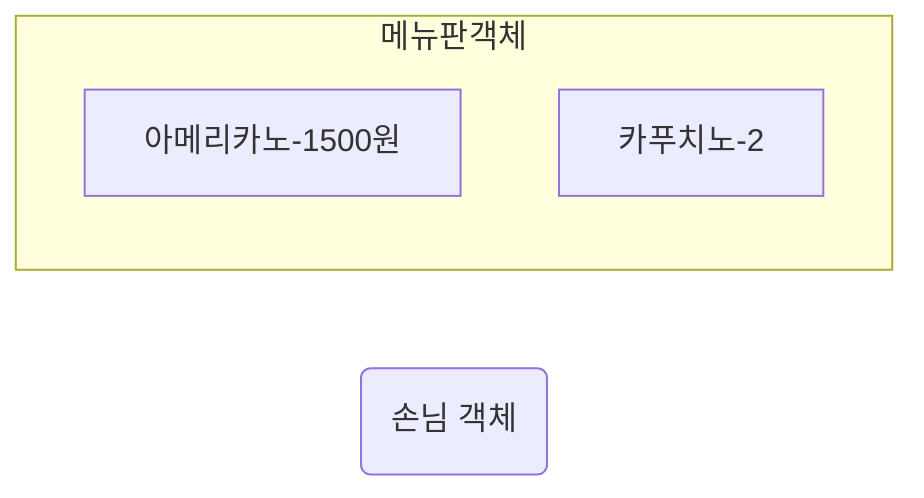

## 커피 전문점이라는 세상
개발에 들어가기 전에 먼저 커피 전문점을 구성하는 요소들에 관해 잠시나마 고민해 보는 것이 도움될 것이다. 객체지향 패러다임의 가장 중요한 도구는 객체이므로 커피 전문점을 객체들로 구성된 작은 세상으로 바라보자.

커피 전문점 안에는 메뉴판이 존재한다. 메뉴판에는 아메리카노, 카푸치노, 카라멜 마키아또, 에스프레소의 네 가지 커피 메뉴가 적혀 있다. 객체지향의 관점에서 메뉴판은 하나의 객체다. 메뉴판은 네 개의 메뉴 항목으로 구성돼 있는데 메뉴 항목들 역시 객체로 볼 수 있다. 따라서 메뉴판은 네 개의 메뉴 항목 객체들을 포함하는 객체라고 볼 수 있다. 

손님은 메뉴판을 보고 바리스타에게 원하는 커피를 주문한다. 객체의 관점에서 보면 손님 역시 하나의 객체다. 손님 객체는 메뉴판 객체 안에 적힌 메뉴 항목 객체들 중에서 자신이 원하는 메뉴 항목 객체 하나를 선택해 바리스타 객체에게 전달할 것이다.

바리스타는 주문을 받은 메뉴에 따라 적절한 커피를 제조한다. 바리스타가 제조할 수 있는 커피의 종류는 아메리카노, 카푸치노, 카라멜 마키아또, 에스프레소의 네 가지다. 바리스타는 자율적으로 커피를 제조하는 객체로 볼 수 있으며, 바리스타가 제조하는 커피 역시 메뉴판, 메뉴 항목, 바리스타와 구별되는 자신만의 경계를 가지므로 객체로 볼 수 있다.

종합해 보면 객체지향의 관점에서 커피 전문점이라는 도메인은 손님 객체, 메뉴 항목 객체, 메뉴판 객체, 바리스타 객체, 커피 객체로 구성된 작은 세상이다.

