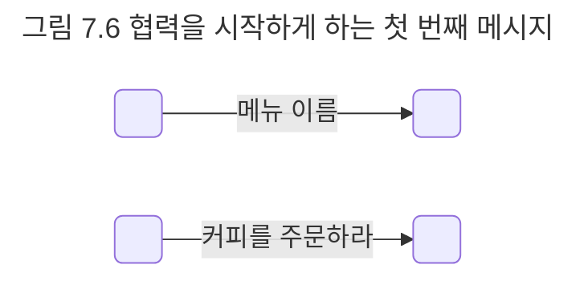

## 커피를 주문하기 위한 협력 찾기
객체지향 설계의 첫 번째 목표는 훌륭한 객체를 설계하는 것이 아니라 훌륭한 협력을 설계하는 것이라는 점을 잊지 말자. 훌륭한 객체는 훌륭한 협력을 설계할 때만 얻을 수 있다.

협력을 설계할 때는 객체가 메시지를 선택하는 것이 아니라 메시지가 객체를 선택하게 해야 한다. 이 말은 메시지를 먼저 선택하고 그 후에 메시지를 수신하기에 적절한 객체를 선택해야 한다는 것을 의미한다. 이제 메시지를 수신할 객체는 메시지를 처리할 책임을 맡게 되고 객체가 수신하는 메시지는 객체가 외부에 제공하는 공용 인터페이스에 포함된다. 

현재 설계하고 있는 협력은 커피를 주문하는 것이다. 아마도 첫 번째 메시지는 '커피를 주문하라'일 것이다.

메시지 위에 붙은 화살표는 메시지에 담아 전달될 부가적인 정보인 인자를 의미한다. 이 경우 '아메리카노를 주문하라' 메시지는 나중에 '커피를 주문하라(아메리카노)'와 같이 인자를 포함하는 형식으로 구현될 것이다.

메시지를 찾았으니 이제 메시지를 