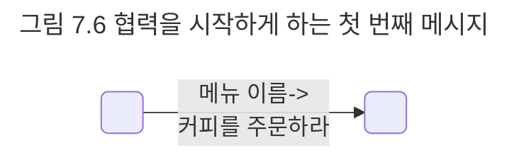
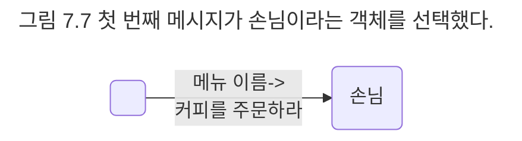
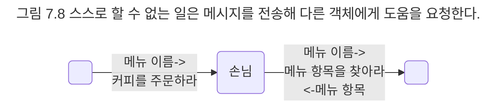
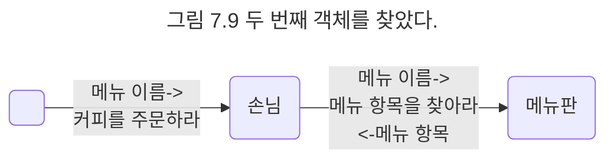
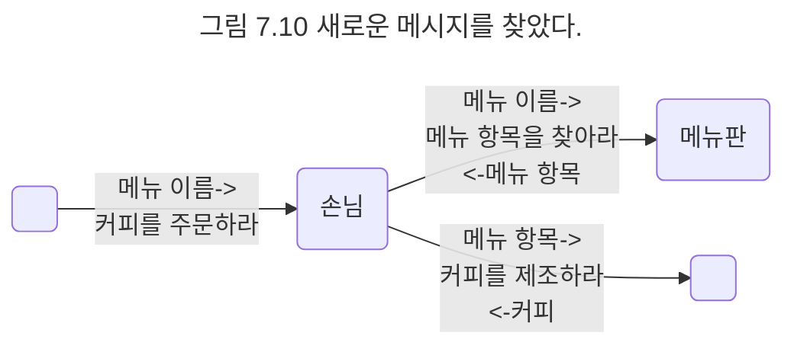
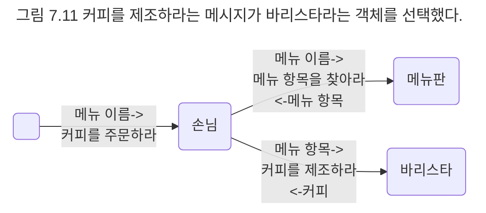
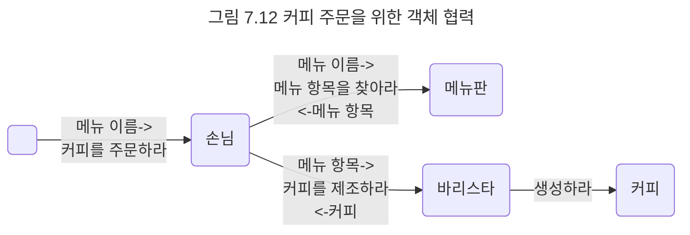

## 커피를 주문하기 위한 협력 찾기
객체지향 설계의 첫 번째 목표는 훌륭한 객체를 설계하는 것이 아니라 훌륭한 협력을 설계하는 것이라는 점을 잊지 말자. 훌륭한 객체는 훌륭한 협력을 설계할 때만 얻을 수 있다.

협력을 설계할 때는 객체가 메시지를 선택하는 것이 아니라 메시지가 객체를 선택하게 해야 한다. 이 말은 메시지를 먼저 선택하고 그 후에 메시지를 수신하기에 적절한 객체를 선택해야 한다는 것을 의미한다. 이제 메시지를 수신할 객체는 메시지를 처리할 책임을 맡게 되고 객체가 수신하는 메시지는 객체가 외부에 제공하는 공용 인터페이스에 포함된다. 

현재 설계하고 있는 협력은 커피를 주문하는 것이다. 아마도 첫 번째 메시지는 '커피를 주문하라'일 것이다.



메시지 위에 붙은 화살표는 메시지에 담아 전달될 부가적인 정보인 인자를 의미한다. 이 경우 '아메리카노를 주문하라' 메시지는 나중에 '커피를 주문하라(아메리카노)'와 같이 인자를 포함하는 형식으로 구현될 것이다.

메시지를 찾았으니 이제 메시지를 처리하기에 적합한 객체를 선택해야 한다. 소프트웨어 객체는 현실 객체의 은유라는 것을 기억하자. 그렇다면 어떤 객체를 은유해야 하는가?

이미 우리는 커피 전문점을 추상화한 도메인 모델이라는 훌륭한 재료를 가지고 있다. 메시지를 처리할 객체를 찾고 있다면 먼저 도메인 모델 안에 책임을 수행하기에 적절한 타입이 존재하는지 살펴보라. 적절한 타입을 발견했다면 책임을 수행할 객체를 그 타입의 인스턴스로 만들어라. 현실 속의 객체와 소프트웨어 객체가 완전히 동일한 수는 없겠지만 적어도 소프트웨어 객체에게 현실 객체와 유사한 이름을 붙여 놓으면 유사성을 통해 소프트웨어 객체가 수행해야 하는 책임과 상태를 좀 더 쉽게 유추할 수 있다. 

본론으로 돌아와서 '커피를 주문하라'라는 메시지를 수신할 객체는 무엇인가? 다른 말로 표현해 어떤 객체가 커피를 주문할 책임을 져야 하는가? 당연히 손님일 것이다. 따라서 메시지를 처리할 객체는 손님 타입의 인스턴스다. 이제 손님 객체는 커피를 주문할 책임을 할당받았다.



손님이 커피를 주문하는 도중에 스스로 할 수 없는 일이 무엇인지 생각해 보자. 손님이 할당된 책임을 수행하는 도중에 스스로 할 수 없는 일이 있다면 다른 객체에게 이를 요청해야 한다. 이 요청이 바로 손님 객체에서 외부로 전송되는 메시지를 정의한다.

손님은 메뉴 항목에 대해서는 알지 못한다. 메뉴 항목은 고객의 일부가 아니라 메뉴판의 일부라는 사실을 기억하라. 따라서 고객은 자신이 선택한 메뉴 항목을 누군가가 제공해 줄 것을 요청한다. '메뉴 항목을 찾아라'라는 새로운 메시지의 등장이다.



이 경우 메시지에 '메뉴 이름'이라는 인자를 포함해 함께 전송한다. 화살표 아래에 붙은 손님으로 향하는 작은 화살표는 이 메시지를 수신한 객체가 손님에게 무엇을 응답해야 하는지를 나타낸다. 이 경우 '메뉴 항목을 찾아라'라는 메시지를 수신한 객체는 '메뉴 이름'에 대응되는 '메뉴 항목'을 반환해야 한다.

메뉴 항목을 찾을 책임을 누구에게 할당하는 것이 좋을까? 메뉴 항목을 가장 잘 알고 있는 객체에게 할당하는 것이 적절할 것이다. 메뉴판 객체는 메뉴 항목 객체를 포함하기 때문에 이 책임을 처리할 수 있는 가장 적절한 후보다.



```text
참고
현실 속의 메뉴판은 자기 스스로 메뉴 항목을 찾지 않을 것이다. 현실 속에서 메뉴판은 손님에 의해 펼쳐지거나 닫혀지는 수동적인 존재다. 그러나 객체지향의 세계로 들어오면 수동적인 메뉴판이라는 개념은 더 이상 유효하지 않다. 객체지향 세계에서는 모든 객체가 능동적이고 자율적인 존재다. 메뉴판은 마치 생명을 가진 존재처럼 자기 스스로 메뉴 항목을 찾는다. 따라서 설계자는 무생물을 생물처럼 '의인화'해야 한다.

소프트웨어 세상 속의 메뉴판은 현실 속의 메뉴판으로부터 모티브를 따왔지만 현실 속의 메뉴판보다 더 많은 일을 할 수 있다. 소프트웨어 안의 메뉴판은 현실 속의 메뉴판이 제공하는 개념을 기반으로 하기 때문에 어떤 일을 수행하는지를 유추하기 쉽다. 소프트웨어 객체는 현실 속의 객체를 모방하거나 추상화한 것이 아니다. 단지 의미를 쉽게 유추할 수 있도록 '은유'할 뿐이다.
```

손님은 자신이 주문한 커피에 대한 메뉴 항목을 얻었으니 이제 메뉴 항목에 맞는 커피를 제조해달라고 요청할 수 있다. 새로운 요청은 새로운 메시지가 필요하다는 행복한 신호다. 손님은 커피를 제조하는 메시지의 인자로 메뉴 항목을 전달하고 반환값으로 제조된 커피를 받아야 한다.



누가 커피를 제조해야 하는가? 당연히 바리스타다.



```text
참고
협력을 가시화하기 위해 사용한 표기법은 UML 표준이 아니다. UML 2.0 표준에서는 협력을 표현하기 위한 용도로 커뮤니케이션 다이어그램을 제공한다. 여기서 커뮤니케이션 다이어그램과 유사하지만 약간 다른 표기법을 사용한 이유는 메시지의 방향과 주고받는 데이터를 좀 더 보기 쉽게 표현하고 싶기 때문이다.

의사소통이라는 목적에 부합하다면 용도에 맞게 얼마든지 UML을 수정하고 뒤틀어라. UML은 의사소통을 위한 표기법이지 꼭 지켜야하는 법칙이 아니다.
```

바리스타는 커피를 제조하는 데 필요한 모든 정보를 알고 있다. 만약 아메리카노를 만들어야 한다면 바리스타의 머릿속에는 이미 아메리카노를 만드는 데 필요한 모든 방법이 들어 있을 것이다. 바리스타는 아메리카노를 만드는 데 필요한 정보와 기술을 함께 구비하고 있는 전문가다. 아메리카노를 만들기 위한 지식은 바리스타의 상태로, 기술은 바리스타의 행동으로 간주할 수 있다. 이런 관점에서 바리스타는 스스로의 판단과 지식에 따라 행동하는 자율적인 존재다.

커피 주문을 위한 협력은 이제 바리스타가 새로운 커피를 만드는 것으로 끝난다.



협력에 필요한 객체의 종류와 책임, 주고받아야 하는 메시지에 대한 대략적인 윤곽이 잡혔다. 남은 일은 메시지를 정제함으로써 각 객체의 인터페이스를 구현 가능할 정도로 상세하게 정제하는 것이다. 