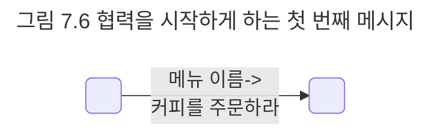
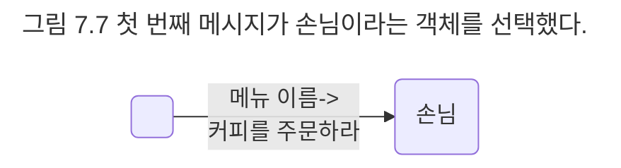
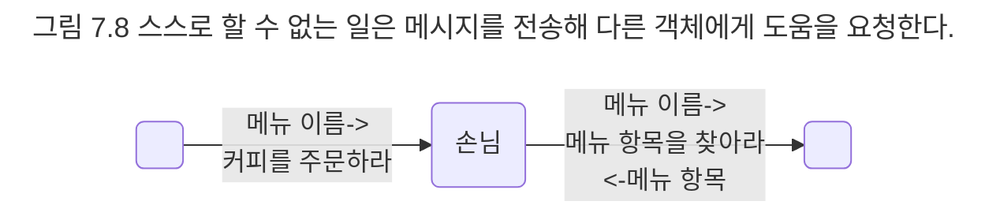

## 커피를 주문하기 위한 협력 찾기
객체지향 설계의 첫 번째 목표는 훌륭한 객체를 설계하는 것이 아니라 훌륭한 협력을 설계하는 것이라는 점을 잊지 말자. 훌륭한 객체는 훌륭한 협력을 설계할 때만 얻을 수 있다.

협력을 설계할 때는 객체가 메시지를 선택하는 것이 아니라 메시지가 객체를 선택하게 해야 한다. 이 말은 메시지를 먼저 선택하고 그 후에 메시지를 수신하기에 적절한 객체를 선택해야 한다는 것을 의미한다. 이제 메시지를 수신할 객체는 메시지를 처리할 책임을 맡게 되고 객체가 수신하는 메시지는 객체가 외부에 제공하는 공용 인터페이스에 포함된다. 

현재 설계하고 있는 협력은 커피를 주문하는 것이다. 아마도 첫 번째 메시지는 '커피를 주문하라'일 것이다.

메시지 위에 붙은 화살표는 메시지에 담아 전달될 부가적인 정보인 인자를 의미한다. 이 경우 '아메리카노를 주문하라' 메시지는 나중에 '커피를 주문하라(아메리카노)'와 같이 인자를 포함하는 형식으로 구현될 것이다.

메시지를 찾았으니 이제 메시지를 처리하기에 적합한 객체를 선택해야 한다. 소프트웨어 객체는 현실 객체의 은유라는 것을 기억하자. 그렇다면 어떤 객체를 은유해야 하는가?

이미 우리는 커피 전문점을 추상화한 도메인 모델이라는 훌륭한 재료를 가지고 있다. 메시지를 처리할 객체를 찾고 있다면 먼저 도메인 모델 안에 책임을 수행하기에 적절한 타입이 존재하는지 살펴보라. 적절한 타입을 발견했다면 책임을 수행할 객체를 그 타입의 인스턴스로 만들어라. 현실 속의 객체와 소프트웨어 객체가 완전히 동일한 수는 없겠지만 적어도 소프트웨어 객체에게 현실 객체와 유사한 이름을 붙여 놓으면 유사성을 통해 소프트웨어 객체가 수행해야 하는 책임과 상태를 좀 더 쉽게 유추할 수 있다. 

본론으로 돌아와서 '커피를 주문하라'라는 메시지를 수신할 객체는 무엇인가? 다른 말로 표현해 어떤 객체가 커피를 주문할 책임을 져야 하는가? 당연히 손님일 것이다. 따라서 메시지를 처리할 객체는 손님 타입의 인스턴스다. 이제 손님 객체는 커피를 주문할 책임을 할당받았다.

손님이 커피를 주문하는 도중에 스스로 할 수 없는 일이 무엇인지 생각해 보자. 손님이 할당된 책임을 수행하는 도중에 스스로 할 수 없는 일이 있다면 다른 객체에게 이를 요청해야 한다. 이 요청이 바로 손님 객체에서 외부로 전송되는 메시지를 정의한다.

손님은 메뉴 항목에 대해서는 알지 못한다. 메뉴 항목은 고객의 일부가 아니라 메뉴판의 일부라는 사실을 기억하라. 따라서 고객은 자신이 선택한 메뉴 항목을 누군가가 제공해 줄 것을 요청한다. '메뉴 항목을 찾아라'라는 새로운 메시지의 등장이다.

