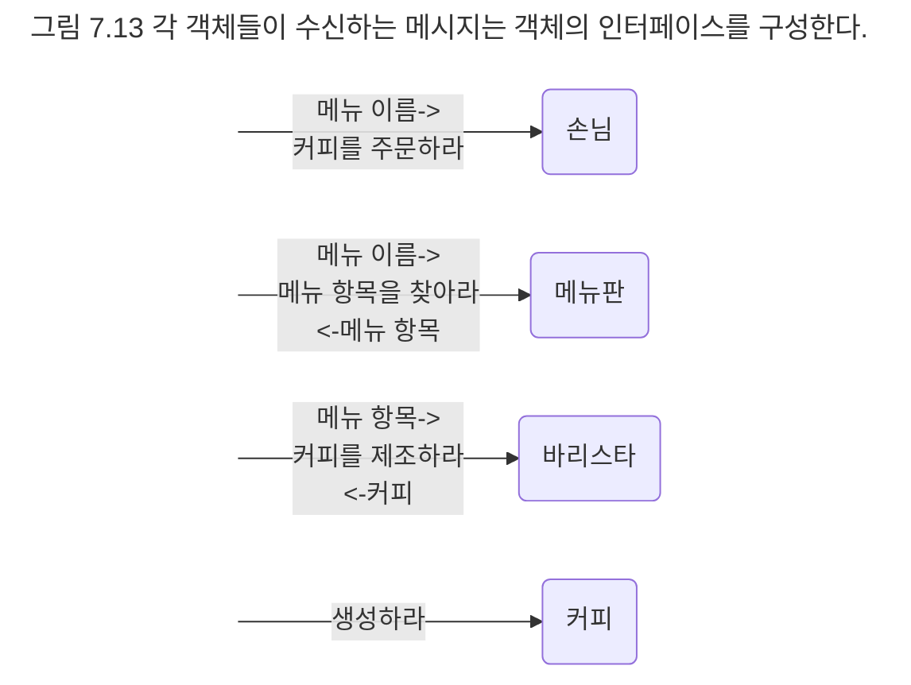

## 인터페이스 정리하기
우리가 힘들여 얻어낸 것은 객체들의 인터페이스다. 객체가 수신한 메시지가 객체의 인터페이스를 결정한다는 사실을 기억하라. 메시지가 객체를 선택했고, 선택된 객체는 메시지를 자신의 인터페이스로 받아들인다.

각 객체를 협력이라는 문맥에서 떼어내고 수신 가능한 메시지만 추려내면 객체의 인터페이스가 된다. 객체가 어떤 메시지를 수신할 수 있다는 것을 그 객체의 인터페이스 안에 메시지에 해당하는 오퍼레이션이 존재한다는 것을 의미한다.

손님 객체의 인터페이스 안에는 '커피를 주문하라'라는 오퍼레이션이 포함돼야 한다. 메뉴판 객체의 인터페이스는 '메뉴 항목을 찾아라'라는 오퍼레이션을 제공하며, 바리스타 객체의 인터페이스는 '커피를 제조하라'라는 오퍼레이션을, 커피 객체는 '생성하라'라는 오퍼레이션을 제공한다.



객체들의 협력은 실행 시간에 컴퓨터 안에서 일어나는 상황을 동적으로 묘사한 모델이다. 실제로 소프트웨어의 구현은 동적인 객체가 아닌 정적인 타입을 이용해 이뤄진다. 따라서 객체들을 포괄하는 타입을 정의한 후 식별된 오퍼레이션을 타입의 인터페이스에 추가해야 한다.

객체의 타입을 구현하는 일반적인 방법은 클래스를 이용하는 것이다. 협력을 통해 식별된 타입의 오퍼레이션은 외부에서 접근 가능한 공용 인터페이스의 일부라는 사실을 기억하라. 따라서 인터페이스에 포함된 오퍼레이션 역시 외부에서 접근 가능하도록 공용(public)으로 선언돼 있어야 한다. 클래스의 인터페이스는 자바의 문법을 이용해 표기했다.

```java
class Customer {
	public void order(String menuName) {}
}

class MenuItem {
}

class Menu {
	public MenuItem choose(String name) {}
}

class Barista {
	public Coffee makeCoffee(MenuItem menuItem) {}
}

class Coffee {
	public Coffee(MenuItem menuItem) {}
}
```