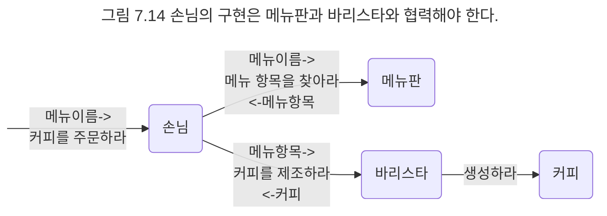

## 구현하기
클래스의 인터페이스를 식별했으므로 이제 오퍼레이션을 수행하는 방법을 메서드로 구현하자. 먼저 Customer의 협력을 살펴보자. Customer는 Menu에게 menuName에 해당하는 MenuItem을 찾아달라고 요청해야 한다. 그리고 MenuItem을 받아 이를 Barista에게 전달해서 원하는 커피를 제조하도록 요청해야 한다.



문제는 Customer가 어떻게 Menu 객체와 Barista 객체에 접근할 것이냐다. 객체가 다른 객체에게 메시지를 전송하기 위해서는 먼저 객체에 대한 참조를 얻어야 한다. 따라서 Customer 객체는 어떤 방법으로든 자신과 협력하는 Menu 객체와 Barista 객체에 대한 참조를 알고 있어야 한다.

객체 참조를 얻는 다양한 방법이 있지만 여기서는 Customer의 order() 메서드의 인자로 Menu와 Barista 객체를 전달받는 방법으로 참조 문제를 해결하기로 한다. 이 결정은 결과적으로 Customer의 인터페이스를 변경한다.

```java
class Customer {
	public void order(String menuName, Menu menu, Barista barista) {}
}
```

남은 것은 order() 메서드의 구현을 채우는 것뿐이다.