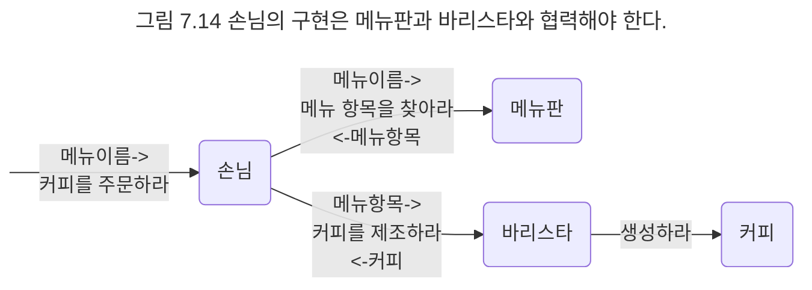
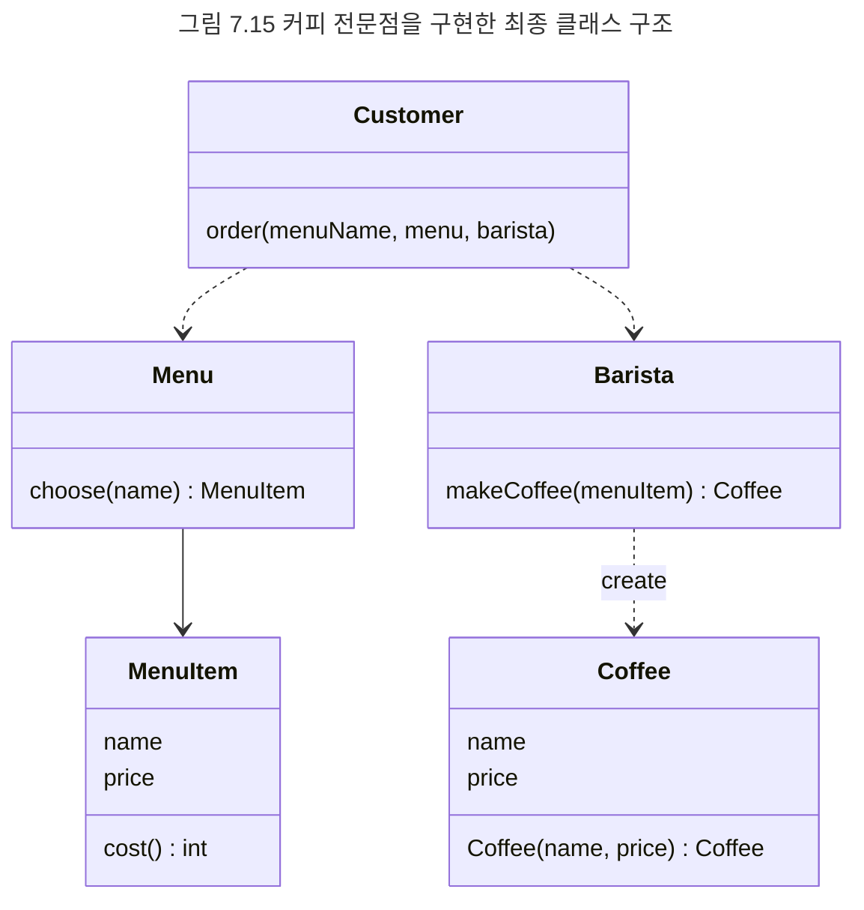

## 구현하기
클래스의 인터페이스를 식별했으므로 이제 오퍼레이션을 수행하는 방법을 메서드로 구현하자. 먼저 Customer의 협력을 살펴보자. Customer는 Menu에게 menuName에 해당하는 MenuItem을 찾아달라고 요청해야 한다. 그리고 MenuItem을 받아 이를 Barista에게 전달해서 원하는 커피를 제조하도록 요청해야 한다.



문제는 Customer가 어떻게 Menu 객체와 Barista 객체에 접근할 것이냐다. 객체가 다른 객체에게 메시지를 전송하기 위해서는 먼저 객체에 대한 참조를 얻어야 한다. 따라서 Customer 객체는 어떤 방법으로든 자신과 협력하는 Menu 객체와 Barista 객체에 대한 참조를 알고 있어야 한다.

객체 참조를 얻는 다양한 방법이 있지만 여기서는 Customer의 order() 메서드의 인자로 Menu와 Barista 객체를 전달받는 방법으로 참조 문제를 해결하기로 한다. 이 결정은 결과적으로 Customer의 인터페이스를 변경한다.

```java
class Customer {
	public void order(String menuName, Menu menu, Barista barista) {}
}
```

남은 것은 order() 메서드의 구현을 채우는 것뿐이다.

```java
class Customer {

	public void order(String menuName, Menu menu, Barista barista) {
		MenuItem menuItem = menu.choose(menuName);
		Coffee coffee = barista.makeCoffee(menuItem);
		...
	}
}
```

구현 도중에 객체의 인터페이스가 변경될 수 있다는 점을 눈여겨보기 바란다.

```text
참고
구현하지 않고 머릿속으로만 구상한 설계는 코드로 구현하는 단계에서 대부분 변경된다. 설계 작업은 구현을 위한 스케치를 작성하는 단계지 구현 그 자체일 수는 없다. 중요한 것은 설계가 아니라 코드다. 따라서 협력을 구상하는 단계에 너무 오랜 시간을 쏟지 말고 최대한 빨리 코드를 구현해서 설계에 이상이 없는지, 설계가 구현 가능한지를 판단해야 한다. 코드를 통한 피드백 없이는 깔끔한 설계를 얻을 수 없다.
```

Menu는 menuName에 해당하는 MenuItem을 찾아야 하는 책임이 있다. 이 책임을 수행하기 위해서는 Menu가 내부적으로 MenuItem을 관리하고 있어야 한다. 간단하게 Menu가 MenuItem의 목록을 포함하게 하자. Menu의 choose() 메서드는 MenuItem의 목록을 하나씩 검사해가면서 이름이 동일한 MenuItem을 찾아 반환한다.

```java
class Menu {

	private List<MenuItem> items;

	public Menu(List<MenuItem> items) {
		this.items = items;
	}

	public MenuItem choose(String name) {
		for(MenuItem each : items) {
			if (each.getName().equals(name)) {
				return each;
			}
		}
		return null;
	}
}
```

```text
참고
MenuItem의 목록을 Menu의 속성으로 포함시킨 결정 역시 클래스를 구현하는 도중에 내려졌다는 사실에 주목하라. 객체의 속성은 객체의 내부 구현에 속하기 때문에 캡슐화돼야 한다. 객체의 속성이 캡슐화된다는 이야기는 인터페이스에는 객체의 내부 속성에 대한 어떤 힌트도 제공돼서는 안 된다는 것을 의미한다. 이를 위한 가장 훌륭한 방법은 인터페이스를 정하는 단게에서는 객체가 어떤 속성을 가지는지, 또 그 속성이 어떤 자료 구조로 구현됐는지를 고려하지 않는 것이다. 객체에게 책임을 할당하고 인터페이스를 결정할 때는 가급적 객체 내부의 구현에 대한 어떤 가정도 하지 말아야 한다. 객체가 어떤 책임을 수행해야 하는지를 결정한 후에야 책임을 수행하는 데 필요한 객체의 속성을 결정하라. 이것이 객체의 구현 세부 사항을 객체의 공용 인터페이스에 노출시키지 않고 인터페이스와 구현을 깔끔하게 분리할 수 있는 기본적인 방법이다.
```

Barista는 MenuItem을 이용해서 커피를 제조한다.

```java
class Barista {

	public Coffee makeCoffee(MenuItem menuItem) {
		Coffee coffee = new Coffee(menuItem);
		return coffee;
	}
}
```

Coffee는 자기 자신을 생성하기 위한 생성자를 제공한다. Coffee는 커피 이름과 가격을 속성으로 가지고 생성자 안에서 MenuItem에 요청을 보내 커피 이름과 가격을 얻은 후 Coffee의 속성에 저장한다.

```java
class Coffee {

	private String name;
	private int price;

	public Coffee(MenuItem menuItem) {
		this.name = menuItem.getName();
		this.price = menuItem.cost();
	}
}
```

MenuItem은 getName()과 cost() 메시지에 응답할 수 있도록 메서드를 구현해야 한다.

```java
public class MenuItem {

	private String name;
	private int price;

	public MenuItem(String name, int price) {
		this.name = name;
		this.price = price;
	}

	public int cost() {
		return price;
	}

	public String getName() {
		return name;
	}
}
```

그림 7.15는 커피 전문점 코드를 클래스 다이어그램으로 나타낸 것이다. 몇 가지 사소한 관계는 생략했지만 커피 전문점을 구성하는 중요한 측면은 모두 포함하고 있다. 




```text
참고
MenuItem의 인터페이스를 구성하는 오퍼레이션들을 MenuItem을 구현하는 단계에 와서야 식별했다는 점을 눈여겨보기 바란다. 이것은 부끄러워해야 할 일이 아니다. 인터페이스는 객체가 다른 객체와 직접적으로 상호작용하는 통로다. 인터페이스를 통해 실제로 상호작용을 해보지 않은 채 인터페이스의 모습을 정확하게 예측하는 것은 불가능에 가깝다. 

설계를 간단히 끝내고 최대한 빨리 구현에 돌입하라. 머릿속에 객체의 협력 구조가 번뜩인다면 그대로 코드를 구현하기 시작하라. 설계가 제대로 그려지지 않는다면 고민하지 말고 실제로 코드를 작성해가면서 협력의 전체적인 밑그림을 그려보라. 테스트-주도 테스
```