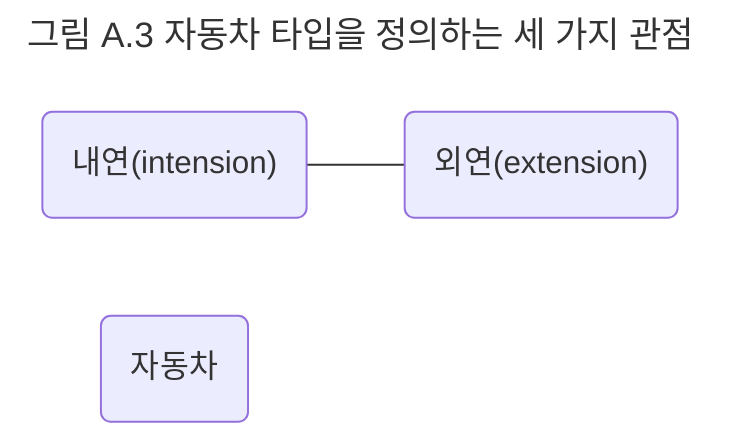

## 타입
객체를 타입에 따라 분류하기 위해서는 객체가 타입에 속하는지 여부를 확인할 수 있어야 한다. 어떤 객체의 타입이 자동차라고 말할 수 있으려면 자동차가 무엇인지에 대한 명확한 정의가 필요하다. 일단 자동차에 대한 명확한 정의가 내려진 후에는 어떤 객체가 자동차 타입의 인스턴스인지 여부를 쉽게 판단할 수 있다. 

타입을 객체의 분류 장치로서 적용할 수 있으려면 다음과 같은 세 가지 관점에서의 정의가 필요하다.

- 심볼 : 타입을 가리키는 간략한 이름이나 명칭
- 내연 : 타입의 완전한 정의, 내연의 의미를 이용해 객체가 타입에 속하는지 여부를 확인할 수 있다.
- 외연 : 타입에 속하는 모든 객체들의 집합

그림 A.3은 어떤 객체를 자동차라는 타입으로 분류하는 데 필요한 정의를 심볼, 내연, 외연 측면에서 나타낸 것이다. 그림 좌측 하단에 표시된 내연은 어떤 객체가 의미적으로 자동차라는 타입에 속하는지 여부를 판단할 수 있는 정의를 제공한다. 만약 어떤 객체가 내연을 만족한다면 그 객체는 우측 하단에 표시된 자동차 집합인 외연의 한 원소로 포함된다. 자동차라는 심볼은 내연과 외연에 모호하지 않은 이름을 붙임으로써 타입을 쉽게 참조하고 커뮤니케이션 할 수 있게 한다. 이처럼 도메인을 분석하는 동안 이름과 의미, 객체들의 집합을 이용해 개념을 정의할 수 있다.

