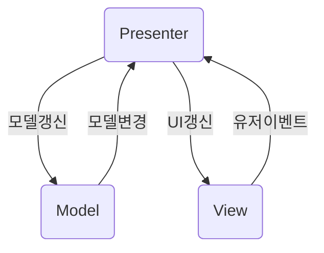

MVP 패턴은 MVC 펀으로부터 파생되었으며 MVC에서 C에 해당하는 컨트롤러가 프레젠터로 교체된 패턴이다.

```mermaid
flowchart TB
	p(Presenter)
	m(Model)
	v(View)

	p ---> |모델갱신| m
	m ---> |모델변경| p

	p ---> |UI갱신| v
	v ---> |유저이벤트| p

```

뷰와 프레젠터는 일대일 관계이기 때문에 MVC 패턴보다 더 강한 결합을 지닌 디자인 패턴이라고 볼 수 있다.