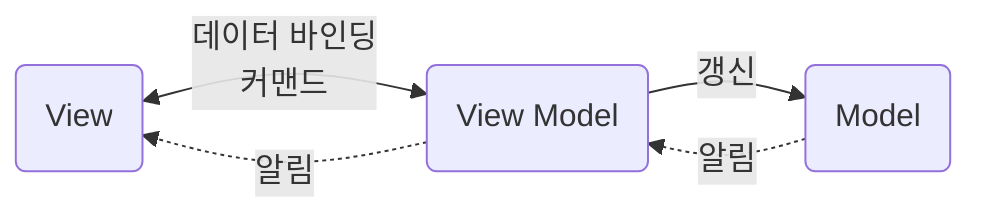

MVVM 패턴은 MVC의 C에 해당하는 컨트롤러가 뷰모델로 바뀐 패턴이다.

여기서 뷰모델은 뷰를 더 추상화한 계층이며, MVVM 패턴은 MVC 패턴과는 다르게 커맨드와 데이터 바인딩을 가지는 것이 특징이다. 뷰와 뷰모델 사이의 양방향 데이터 바인딩을 지원하며 UI를 별도의 코드 수정 없이 재사용할 수 있고 단위 테스팅하기 쉽다는 장점이 있다.

## MVVM 패턴의 예 : 뷰
MVVM 패턴을 가진 대표적인 프레임워크로는 뷰가 있다. Vue.js는 반응형이 특징인 프론트엔드 프레임워크이다. 예를 들어 watch와 computed 등으로 쉽게 반응형적인 값들을 구축할 수 있다.

함수를 사용하지 않고 값 대입만으로도 변수가 변경되며 양방향 바인딩, html을 토대로 컴포넌트를 구축할 수 있다는 점이 특징이다. 재사용 가능한 컴포넌트 기반으로 UI를 구축할 수 있으며 BMW, 구글, 루이비통 등에서 사용한다.

**커맨드**
여러 가지 요소에 대한 처리를 하나의 액션으로 처리할 수 있게 하는 기법이다.

**데이터 바인딩**
화면에 보이는 데이터와 웹 브라우저의 메모리 데이터를 일치시키는 기법으로, 뷰모델을 변경하면 뷰가 변경된다.