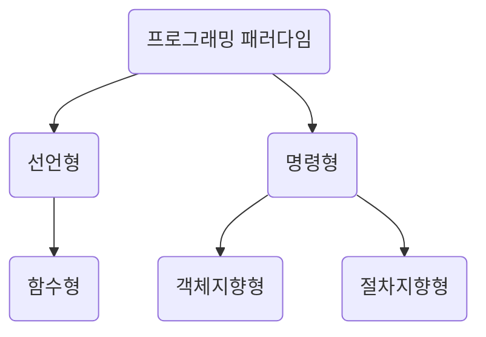

프로그래밍 패러다임은 프로그래머에게 프로그래밍의 관점을 갖게 해주는 역할을 하는 개발 방법론이다.

예를 들어 객체지향 프로그래밍은 프로그래머들이 프로그램을 상호 작용하는 객체들의 집합으로 볼 수 있게 하는 반면에, 함수형 프로그래밍은 상태 값을 지니지 않는 함수 값들의 연속으로 생각할 수 있게 해준다.

어떤 언어는 특정한 패러다임을 지원하기도 하는데, jdk 1.8 이전의 자바는 객체지향 프로그래밍을 지원하는 반면에, 하스켈은 함수형 프로그래밍을 지원한다. 여러 패러다임을 지원하는 언어로는 C++, 파이썬, 자바스크립트가 있으며 자바의 경우 jdk 1.8부터 함수형 프로그래밍 패러다임을 지원하기 위해 람다식, 생성자 레퍼런스, 메서드 레퍼런스를 도입했고 선언형 프로그래밍을 위해 스트림 같은 표준 API 등도 추가했다.

프로그래밍 패러다임은 크게 선언형, 명령형으로 나누며, 선언형은 함수형이라는 하위 집합을 갖는다. 또한, 명령형은 다시 객체지향, 절차지향으로 나눈다.

## 선언형과 함수형 프로그래밍
선언형 프로그래밍이란 '무엇을' 풀어내는가에 집중하는 패러다임이며, "프로그램은 함수로 이루어진 것이다."라는 명제가 담겨 있는 패러다임이기도 하다. 함수형 프로그래밍은 선언형 패러다임의 일종이다. 지금부터 함수형 프로그래밍에 대해 알아보자.

