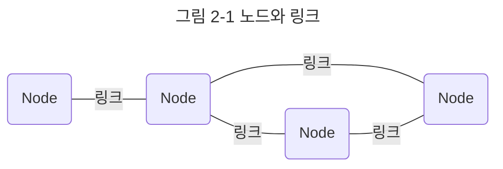

네트워크는 컴퓨터 등의 장치들이 통신 기술을 이용하여 구축하는 연결망을 지칭하는 용어이다. 네트워크의 기초부터 시작해서 네트워크를 이루는 계층, 장치 등에 대해 배워 보자.

네트워크란 노드와 링크가 서로 연결되어 있거나 연결되어 있으며 리소스를 공유하는 집합을 의미한다.



여기서 노드란 서버, 라우터, 스위치 등 네트워크 장치를 의미하고 링크는 유선 또는 무선을 의미한다.

## 처리량과 지연 시간
네트워크를 구축할 때는 '좋은' 네트워크로 만드는 것이 중요하다. 좋은 네트워크란 많은 처리량을 처리할 수 있으며 지연 시간이 짧고 장애 빈도가 적으며 좋은 보안을 갖춘 네트워크를 말한다.

### 처리량
처리량이란 링크를 통해 전달되는 단위 시간당 데이터양을 말한다.

단위로는 bps(bits per second)를 쓴다. 초당 전송 또는 수신되는 비트 수라는 의미이다.

처리량은 사용자들이 많이 접속할 때마다 커지는 트래픽, 네트워크 장치 간의 대역폭, 네트워크 중간에 발생하는 에러, 장치의 하드웨어 스펙에 영향을 받는다.

**대역폭**
주어진 시간 동안 네트워크 연결을 통해 흐를 수 있는 최대 비트 수


### 지연 시간
지연 시간이란 요청이 처리되는 시간을 말하며 어떤 메시지가 두 장치 사이를 왕복하는 데 걸린 시간을 말한다.

```mermaid
---
title : 그림 2-3 지연 시간
---
flowchart LR
	d1("장치1")
	d2[("장치2")]
	text("총 지연시간 = 800ms + )

	d1 ---> |800ms| d2
	d2 ---> |900ms| d1

```