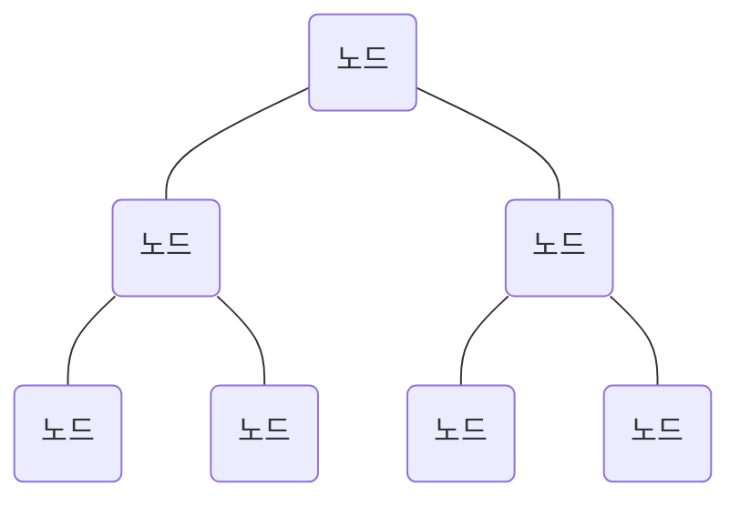
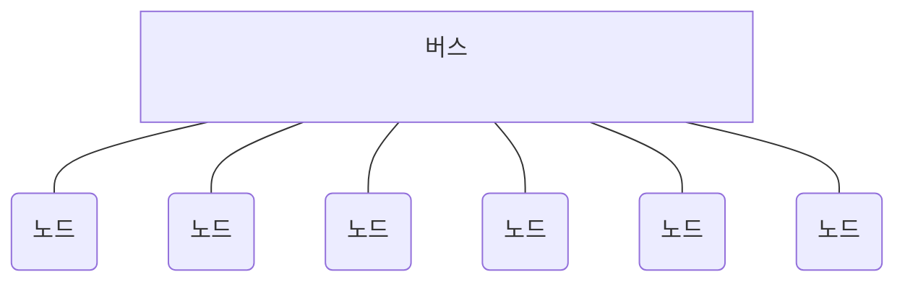
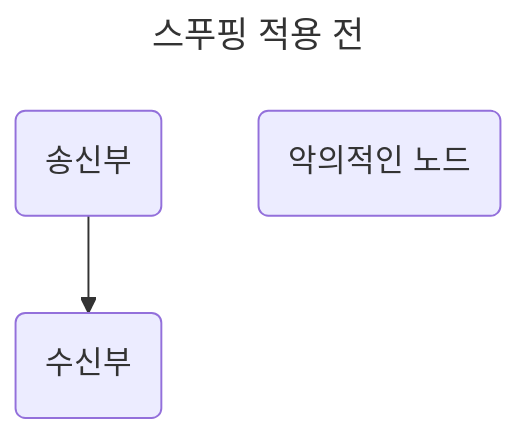
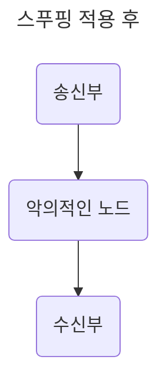
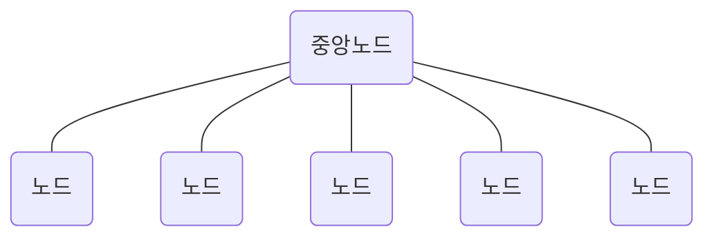
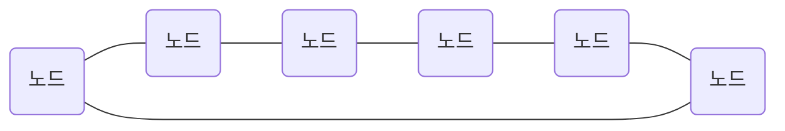
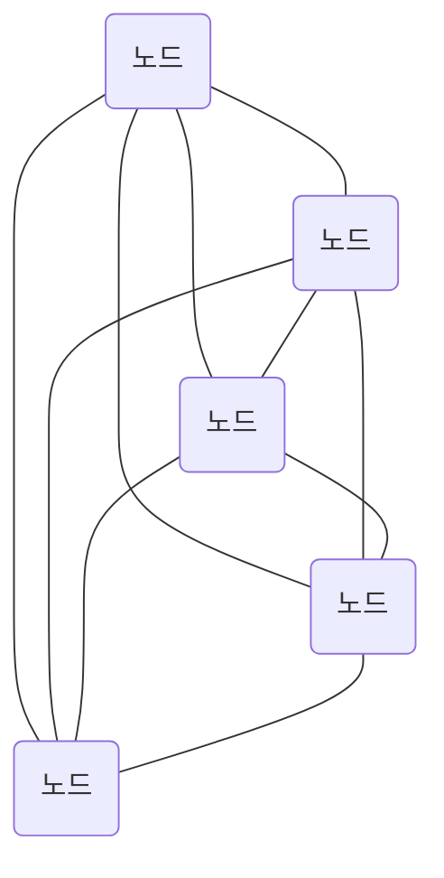
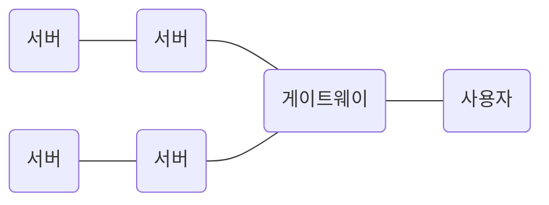
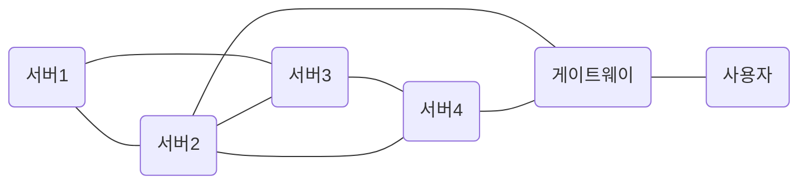

## 네트워크 토폴로지
네트워크를 설계할 때 고려하는 네트워크 토폴로지를 알아보자. 넽,워크 토폴로지는 노드와 링크가 어떻게 배치되어 있는지에 대한 방식이자 연결 형태를 의미한다.

### 트리 토폴로지
트리 토폴로지는 계층형 토폴로지라고 하며 트리 형태로 배치한 네트워크 구성을 말한다.

노드의 추가, 삭제가 쉬우며 특정 노드에 트래픽이 집중될 때 하위 노드에 영향을 끼칠 수 있다.

### 버스 토폴로지
버스 토폴로지는 중앙 통신 회선 하나에 여러 개의 노드가 연결되어 공유하는 네트워크 구성을 말하고 근거리 통신망에서 사용한다.

설치 비용이 적고 신뢰성이 우수하며 중앙 통신 회선에 노드를 추가하거나 삭제하기 쉽다. 그러나 스푸핑이 가능한 문제점이 있다.

#### 스푸핑
스푸핑은 LAN 상에서 송신부의 패킷을 송신과 관련 없는 다른 호스트에 가지 않도록 하는 스위칭 기능을 마비시키거나 속여서 특정 노드에 해당 패킷이 오도록 처리하는 것을 말한다.

앞의 그림처럼 스푸핑을 적용하면 올바르게 수신부로 가야 할 패킷이 악의적인 노드에 전달되게 된다.

### 스타 토폴로지
스타 토폴로지는 중앙에 있는 노드에 모두 연결된 네트워크 구성을 말한다.

노드를 추가하거나 에러를 탐지하기 쉽고 패킷의 충돌 발생 가능성이 적다. 또한, 어떠한 노드에 장애가 발생해도 쉽게 에러를 발견할 수 있으며 장애 노드가 중앙 노드가 아닐 경우 다른 노드에 영향을 끼치는 것이 적다. 하지만 중앙 노드에 장애가 발생하면 전체 네트워크를 사용할 수 없고 설치 비용이 고가이다.

### 링형 토폴로지
링형 토폴로지는 각각의 노드가 양 옆의 두 노드와 연결하여 전체적으로 고리처럼 하나의 연속된 길을 통해 통신을 하는 망 구성 방식이다.

데이터는 노드에서 노드로 이동을 하게 되고, 각각의 노드는 고리 모양의 길을 통해 패킷을 처리한다.

노드 수가 증가되어도 네트워크상의 손실이 거의 없고 충돌이 발생되는 가능성이 적고 노드의 고장 발견을 쉽게 찾을 수 있다. 하지만 네트워크 구성 변경이 어렵고 회선에 장애가 발생하면 전체 네트워크에 영향을 크게 끼치는 단점이 있다.

### 메시 토폴로지
메시 토폴로지는 망형 토폴로지라고도 하며 그물망처럼 연결되어 있는 구조이다.

한 단말 장치에 장애가 발생해도 여러 개의 경로가 존재하므로 네트워크를 계속 사용할 수 있고 트래픽도 분산 처리가 가능하다. 하지만 노드의 추가가 어렵고 구축 비용과 운용 비용이 고가인 단점이 있다.

## 병목 현상
네트워크의 구조라고도 일컫는 토폴로지가 중요한 이유는 병목 현상을 찾을 때 중요한 기준이 되기 때문이다.

예를 들어 앞의 그림처럼 서비스를 만들었는데, 병목 현상이 일어나서 사용자가 서비스를 이용할 때 지연 시간이 길게 발생하고 있다고 해보자. 관리자가 지연 시간을 짧게 만들기 위해 대역폭을 크게 설정했음에도 성능이 개선되지 않았다.

관리자가 네트워크 토폴로지가 어떻게 되어 있나 확인했고, 서버와 서버 간 그리고 게이트웨이로 이어지는 회선을 추가해서 병목 현상을 해결했다. 이처럼 네트워크가 어떤 토폴로지를 갖는지, 또한 어떠한 경로로 이루어져 있는지 알아야 병목 현상을 올바르게 해결할 수 있다.

**병목 현상**
병목 현상은 전체 시스템의 성능이나 용량이 하나의 구성 요소로 인해 제한을 받는 현상을 말한다. 예를 들어 병의 몸통보다 병의 목 부분 내부 지름이 좁아서 물이 상대적으로 천천히 쏟아지는 것에 비유할 수 있다. 서비스에서 이벤트를 열었을 때 트래픽이 많이 생기고 그 트래픽을 잘 관리하지 못하면 병목 현상이 생겨 사용자는 웹 사이트로 들어가지 못한다.