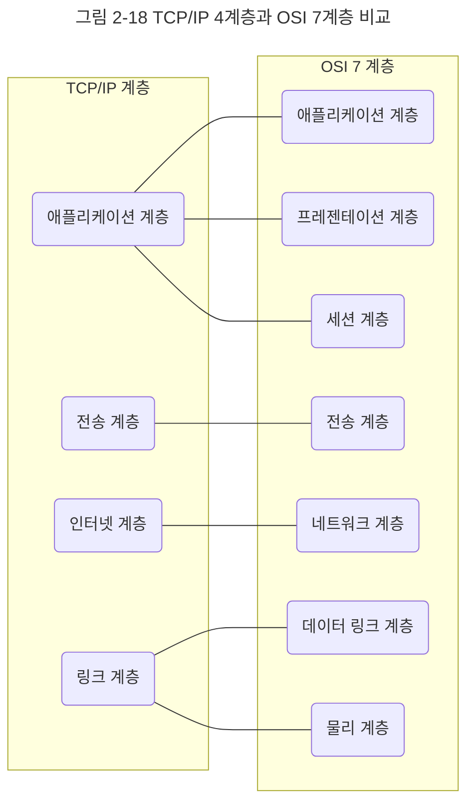
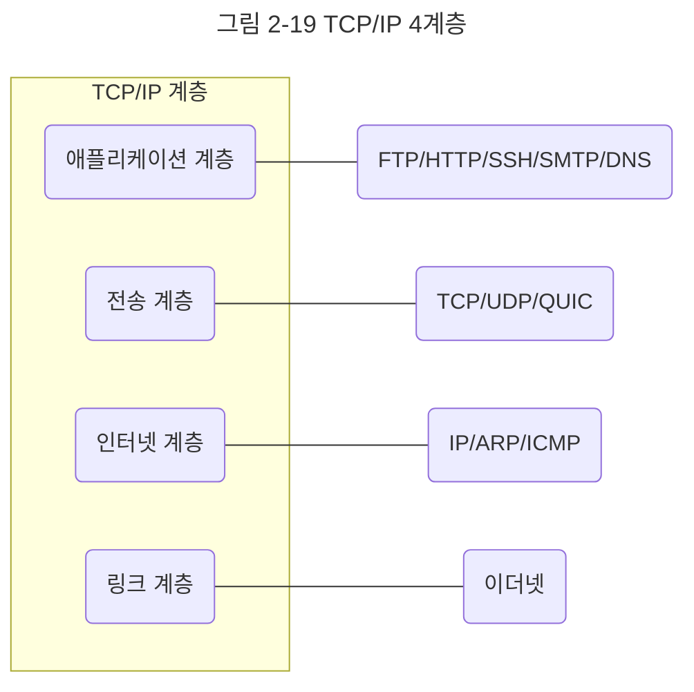

인터넷 프로토콜 스위트는 인터넷에서 컴퓨터들이 서로 정보를 주고받는 데 쓰이는 프로토콜의 집합이며, 이를 TCP/IP 4계층 모델로 설명하거나 OSI 7계층 모델로 설명하기도 한다. 이 책에서는 TCP/IP(Transmission Control Protocol/Internet Protocol) 4계층 모델을 중심으로 설명하고, 이 계층 모델은 네트워크에서 사용되는 통신 프로토콜의 집합으로 계층들은 프로토콜의 네트워킹 범위에 따라 네 개의 추상화 계층으로 구성된다.

## 계층 구조
TCP/IP 계층은 네 개의 계층을 가지고 있고 OSI 7계층과 많이 비교한다.

앞의 그림처럼 TCP/IP 계층과 달리 OSI 계층은 애플리케이션 계층을 세 개로 쪼개고 링크 계층을 데이터 링크 계층, 물리 계층으로 나눠서 표현하는 것이 다르며, 인터넷 계층을 네트워크 계층으로 부른다는 점이 다릅니다.

이 계층들은 특정 계층이 변경되었을 때 다른 계층이 영향을 받지 않도록 설계되었다. 예를 들어 전송 계층에서 TCP를 UDP로 변경했다고 해서 인터넷 웹 브라우저를 다시 설치해야 하는 것은 아니듯 유연하게 설계된 것이다.

각 계층을 대표하는 스택을 정리한 그림이다.

지금부터 애플리케이션 계층부터 하나씩 살펴보자.

### 애플리케이션 계층
애플리케이션 계층은 FTP, HTTP, SSH, SMTP, DNS 등 응용 프로그램이 사용되는 프로토콜 계층이며 웹 서비스, 이메일 등 서비스를 실질적으로 사람들에게 제공하는 층이다.

**FTP**
- 장치와 장치 간의 파일을 전송하는 데 사용되는 표준 통신 프로토콜

**SSH**
- 보안되지 않은 네트워크에서 네트워크 서비스를 안전하게 운영하기 위한 암호화 네트워크 프로토콜

**HTTP**
- World Wide Web을 위한 데이터 통신의 기초이자 웹 사이트를 이용하는 데 쓰는 프로토콜

**SMTP**
- 전자 메일 전송을 위한 인터넷 표준 통신 프로토콜

**DNS**
- 도메인 이름과 IP 주소를 매핑해주는 서버, 예를 들어 `www.naver.com` 에 DNS 쿼리가 오면 `[Root DNS] -> [.com DNS] -> [.naver DNS] -> [.www DNS]` 과정을 거쳐 완벽한 주소를 찾아 IP 주소를 매핑한다. 이를 통해 IP 주소가 바뀌어도 사용자들에게 똑같은 도메인 주소로 서비스할 수 있다.

### 전송 계층
전송 계층은 송신자와 수신자를 연결하는 통신 서비스를 제공하며 연결 지향 데이터 스트림 지원, 신뢰성, 흐름 제어를 제공할 수 있으며 애플리케이션과 인터넷 계층 사이의 데이터가 전달될 때 중계 역할을 한다. 대표적으로 TCP 와 UDP가 있다.

TCP는 패킷 사이의 순서를 보장하고 연결지향 프로토콜을 사용해서 연결을 하여 신뢰성을 구축해서 수신여부를 확인하며 '가상회선 패킷 교환 방식'을 사용한다.

UDP는 순서를 보장하지 않고 수신 여부를 확인하지 않으며 단순히 데이터만 주는 '데이터그램 패킷 교환 방식'을 사용한다.

#### 가상회선 패킷 교환 방식
가상 회선 패킷 교환 방식은 각 패킷에는 가상회선 식별자가 포함되며 모든 패킷을 전송하면 가상회선이 해제되고 패킷들은 전송된 '순서대로' 도착하는 방식을 말한다.

#### 데이터그램 패킷 교환 방식
데이터그램 패킷 교환 방식이란 패킷이 독립적으로 이동하며 최적의 경로를 선택하여 가는데, 하나의 메시지에서 분할된 여러 패킷은 서로 다른 경로로 전송될 수 있으며 도착한 '순서가 다를 수' 있는 방식을 뜻한다.

#### TCP 연결 성립 과정
TCP는 신뢰성을 확보할 때 '3-웨이 '