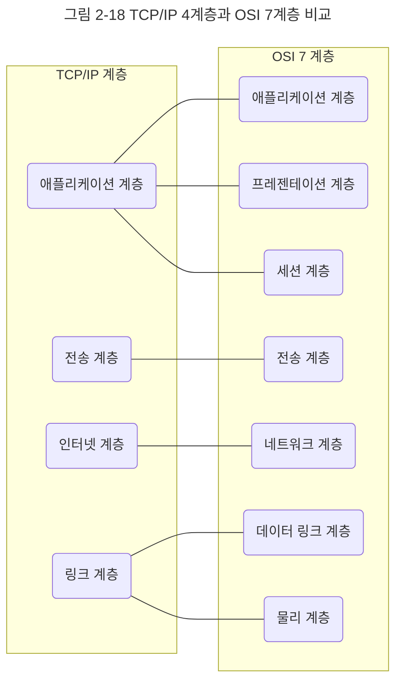
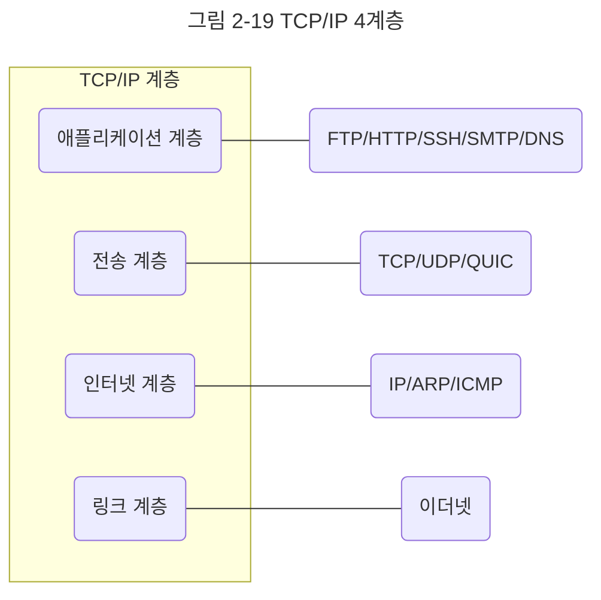

인터넷 프로토콜 스위트는 인터넷에서 컴퓨터들이 서로 정보를 주고받는 데 쓰이는 프로토콜의 집합이며, 이를 TCP/IP 4계층 모델로 설명하거나 OSI 7계층 모델로 설명하기도 한다. 이 책에서는 TCP/IP(Transmission Control Protocol/Internet Protocol) 4계층 모델을 중심으로 설명하고, 이 계층 모델은 네트워크에서 사용되는 통신 프로토콜의 집합으로 계층들은 프로토콜의 네트워킹 범위에 따라 네 개의 추상화 계층으로 구성된다.

## 계층 구조
TCP/IP 계층은 네 개의 계층을 가지고 있고 OSI 7계층과 많이 비교한다.

앞의 그림처럼 TCP/IP 계층과 달리 OSI 계층은 애플리케이션 계층을 세 개로 쪼개고 링크 계층을 데이터 링크 계층, 물리 계층으로 나눠서 표현하는 것이 다르며, 인터넷 계층을 네트워크 계층으로 부른다는 점이 다릅니다.

이 계층들은 특정 계층이 변경되었을 때 다른 계층이 영향을 받지 않도록 설계되었다. 예를 들어 전송 계층에서 TCP를 UDP로 변경했다고 해서 인터넷 웹 브라우저를 다시 설치해야 하는 것은 아니듯 유연하게 설계된 것이다.

각 계층을 대표하는 스택을 정리한 그림이다.

지금부터 애플리케이션 계층부터 하나씩 살펴보자.

### 애플리케이션 계층
애플리케이션 계층은 FTP, HTTP, SSH, SMTP, DNS 등 응용 프로그램이 사용되는 ㅍ