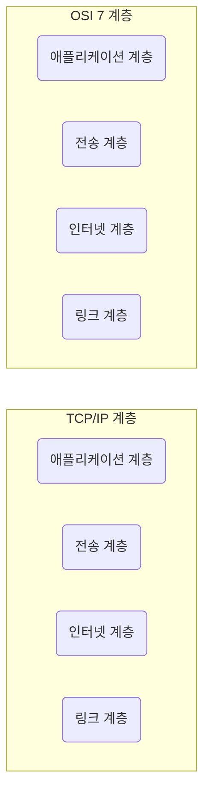

인터넷 프로토콜 스위트는 인터넷에서 컴퓨터들이 서로 정보를 주고받는 데 쓰이는 프로토콜의 집합이며, 이를 TCP/IP 4계층 모델로 설명하거나 OSI 7계층 모델로 설명하기도 한다. 이 책에서는 TCP/IP(Transmission Control Protocol/Internet Protocol) 4계층 모델을 중심으로 설명하고, 이 계층 모델은 네트워크에서 사용되는 통신 프로토콜의 집합으로 계층들은 프로토콜의 네트워킹 범위에 따라 네 개의 추상화 계층으로 구성된다.

## 계층 구조
TCP/IP 계층은 네 개의 계층을 가지고 있고 OSI 7계층과 많이 비교한다.

