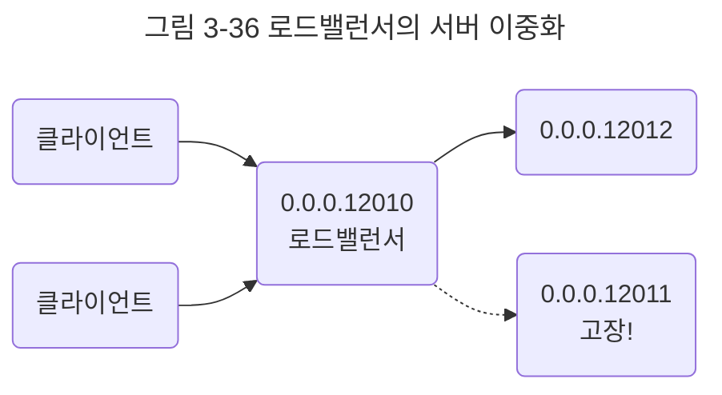

애플리케이션 계층을 처리하는 기기로는 L7 스위치가 있다.

## L7 스위치
스위치는 여러 장비를 연결하고 데이터 통신을 중재하며 목적지가 연결된 포트로만 전기 신호를 보내 데이터를 전송하는 통신 네트워크 장비이다.

L7 스위치는 로드밸런서라고도 하며, 서버의 부하를 분산하는 기기이다. 클라이언트로부터 오는 요청들을 뒤쪽의 여러 서버로 나누는 역할을 하며 시스템이 처리할 수 있는 트래픽 증가를 목표로 한다.

URI, 서버, 캐시, 쿠키들을 기반으로 트래픽을 분산한다. 또한, 바이러스, 불필요한 외부 데이터 등을 걸러내는 필터링 기능 또한 가지고 있으며 응용 프로그램 수준의 트래픽 모니터링도 가능하다.

만약 장애가 발생한 서버가 있다면 이를 트래픽 분산 대상에서 제외해야 하는데, 이는 정기적으로 헬스 체크를 이용하여 감시하면서 이루어진다.

### L4 스위치와 L7 스위치 차이
로드밸런서로는 L7 스위치뿐만 아니라 L4 스위치도 있다. L4 스위치는 전송 계층을 처리하는 기기로 스트리밍 관련 서비스에서는 사용할 수 없으며 메시지를 기반으로 인식하지 못하고 IP와 포트를 기반으로(특히 포트를 기반으로) 트래픽을 분산한다. 반면 L7 로드밸런서는 IP, 포트 외에도 URL, HTTP 헤더, 쿠키 등을 기반으로 트래픽을 분산한다.

참고로 클라우드 서비스에서 L7 스위치를 이용한 로드밸런싱은 ALB(Application Load Balancer) 컴포넌트로 하며, L4 스위치를 이용한 로드밸런싱은 NLB(Network Load Balancer) 컴포넌트로 한다.

### 헬스 체크
L4 스위치 또는 L7 스위치 모두 헬스 체크를 통해 정상적인 서버 또는 비정상적인 서버를 판별하는데, 헬스 체크는 전송 주기와 재전송 횟수 등을 설정한 이후 반복적으로 서버에 요청을 보내는 것을 말한다. 

물론 이때 서버에 부하가 되지 않을 만큼 요청 횟수가 적절해야 한다. TCP, HTTP 등 다양한 방법으로 요청을 보내며 이 요청이 정상적으로 이루어졌다면 정상적인 서버로 판별한다. 예를 들어 TCP 요청을 보냈는데 3-웨이 핸드셰이크가 정상적으로 일어나지 않았다면 정상이 아닌 것이다.

### 로드밸런서를 이용한 서버 이중화
로드밸런서는 대표적인 기능으로 서버 이중화를 들 수 있다. 서비스를 안정적으로 운용하기 위해서는 2대 이상의 서버는 필수적이다. 에러가 발생하여 서버 1대가 종료되더라도 서비스는 안정적으로 운용되어야 하기 때문이다.

로드밸런서는 2대 이상의 서버를 기반으로 가상 IP를 제공하고 이를 기반으로 안정적인 서비스를 제공한다.

앞의 그림처럼 로드밸런서가 제공한 `0.0.0.12010` 이란 가상 IP에 사용자들이 접근하고 뒷단에 사용 가능한 서버인 `0.0.0.12011`과 `0.0.0.12012`를 기반으로 서빙한다. 이렇게 하면 `0.0.0.12011`이란 서버에 장애가 발생해도 그것과는 무방하게 `0.0.0.12012` 서버를 기반으로 안정적인 서비스를 운용할 수 있는 것이다.