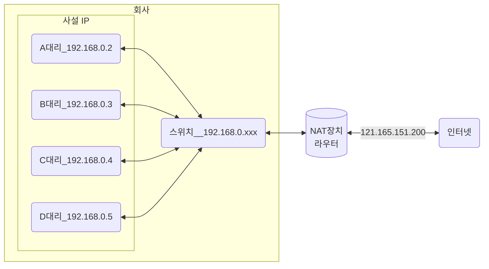

IP 주소는 IPv4와 IPv6로 나뉜다. IPv4는 32비트를 8비트 단위로 점을 찍어 표기하며, 123.45.67.89 같은 방식으로 IP 주소를 나타낸다. IPv6는 64비트를 16비트 단위로 점을 찍어 표기하며, 2001:db8::ff00:42:9329 같은 방식으로 IP 주소를 나타낸다.

추세는 IPv6로 가고 있지만 현재 가장 많이 쓰이는 주소 체계는 IPv4이며 이후에 설명할 때도 IPv4를 기준으로 설명한다.

## 클래스 기반 할당 방식
IP 주소 체계는 과거를 거쳐 발전해오고 있으며 처음에는 A, B, C, D, E 다섯 개의 클래스로 구분하는 클래스 기반 할당 방식을 썼다. 앞서 있는 부분을 네트워크 주소, 그 뒤에 있는 부분을 컴퓨터에 부여하는 주소인 호스트 주소로 놓아서 사용한다.

클래스 A, B, C는 일대일 통신으로 사용되고 클래스 D는 멀티캐스트 통신, 클래스 E는 앞으로 사용할 예비용으로 쓰는 방식이다. 예를 들어 클래스 A의 경우 0.0.0.0부터 127.255.255.255까지 범위를 갖는다.

맨 왼쪽에 있는 비트를 '구분 비트'라고 한다. 클래스 A의 경우 맨 왼쪽에 있는 비트가 0이다. 클래스 B는 10이다. 클래스 C는 110이다. 이를 통해 클래스 간의 IP가 나눠진다. 클래스 A에서 가질 수 있는 IP 범위는 십진수로 0.0.0.0 ~ 127.255.255.255이다. 다른 네트워크도 이런 식의 주소 범위를 가진다고 생각하면 된다.

또한, 네트워크의 첫 번째 주소는 네트워크 주소로 사용되고 가장 마지막 주소는 브로드캐스트용 주소로 네트워크에 속해 있는 모든 컴퓨터에 데이터를 보낼 때 사용된다.

예를 들어 클래스 A로 12.0.0.0이란 네트워크를 부여받았다고 하자. 그렇다면 12.0.0.1 ~ 12.255.255.254의 호스트 주소를 부여받은 것이다. 이때 첫 번째 주소인 12.0.0.0은 네트워크 구별 주소로 사용하면 안 되고 가장 마지막 주소인 12.255.255.255의 경우 브로드캐스트용으로 남겨두어야 하니 이도한 사용하면 안 된다. 그렇기 때문에 그 사이에 있는 12.0.0.1 ~ 12.255.255.254를 컴퓨터에 부여할 수 있는 호스트 주소로 사용할 수 있다.

하지만 이 방식은 사용하는 주소보다 버리는 주소가 많은 단점이 있었고 이를 해소하기 위해 DHCP와 IPv6, NAT가 나온다.

## DHCP
DHCP는 IP 주소 및 기타 통신 매개변수를 자동으로 할당하기 위한 네트워크 관리 프로토콜이다. 이 기술을 통해 네트워크 장치의 IP 주소를 수동으로 설정할 필요없이 인터넷에 접속할 때마다 자동으로 IP 주소를 할당할 수 있다.

많은 라우터와 게이트웨이 장비에 DHCP 기능이 있으며 이를 통해 대부분의 가정용 네트워크에서 IP 주소를 할당한다.

## NAT
NAT은 패킷이 라우팅 장치를 통해 전송되는 동안 패킷의 IP 주소 정보를 수정하여 IP 주소를 다른 주소로 매핑하는 방법이다. IPv4 주소 체계만으로는 많은 주소들을 모두 감당하지 못하는 단점이 있는데, 이를 해결하기 위해 NAT로 공인 IP와 사설 IP로 나눠서 많은 주소를 처리한다. NAT를 가능하게 하는 소프트웨어는 ICS, RRAS, Netfilter 등이 있다.

앞의 그림처럼 대리들은 `129.168.0.xxx`를 기반으로 각각의 다른 IP를 가지고 있다. 이는 사설 IP라고 한다. 그리고 NAT 장치를 통해 하나의 공인 IP인 `121.165.151.200`으로 외부 인터넷에 요청할 수 있다.

이를 통해 회사에 있는 A대리와 B대리는 하나의 IP인 `121.165.151.200`을 기반으로 각각의 다른 IP를 가지는 것처럼 인터넷을 사용할 수 있다. 이처럼 NAT 장치를 통해 사설 IP를 공인 IP로 변환하거나 공인 IP를 사설 IP로 변환하는 데 쓰인다.

### 공유기와 NAT
NAT를 쓰는 이유는 주로 여러 대의 호스트가 하나의 공인 IP 주소를 사용하여 인터넷에 접속하기 위함이다. 예를 들어 인터넷 회선 하나를 개통하고 인터넷 공유기를 달아서 여러 PC를 연결하여 사용할 수 있는데, 이것이 가능한 이유는 인터넷 공유기에 NAT 기능이 탑재되어 있기 때문이다.

### NAT를 이용한 보안
NAT를 이용하면 내부 네트워크에서 사용하는 IP 주소와 외부에 드러나는 IP 주소를 다르게 유지할 수 있기 때문에 내부 네트워크에 대한 어느 정도의 보안이 가능해진다.

### NAT의 단점
NAT는 여러 명이 동시에 인터넷을 접속하게 되므로 실제로 접속하는 호스트 숫자에 따라서 접속 속도가 느려질 수 있다는 단점이 있다.