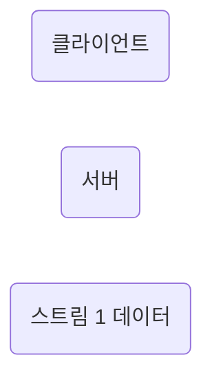

# 02-17. HTTP/2
HTTP/2는 SPDY 프로토콜에서 파생된 HTTP/1.x 보다 지연 시간을 줄이고 응답 시간을 더 빠르게 할 수 있으며 멀티플렉싱, 헤더 압축, 서버 푸시, 요청의 우선순위 처리를 지원하는 프로토콜이다.

## 멀티플렉싱
멀티플렉싱이란 여러 개의 스트림을 사용하여 송수신한다는 것이다. 이를 통해 특정 스트림의 패킷이 손실되었다고 하더라도 해당 스트림에만 영향을 미치고 나머지 스트림은 멀쩡하게 동작할 수 있다.

**스트림**\
시간이 지남에 따라 사용할 수 있게 되는 일련의 데이터 요소를 가리키는 데이터 흐름

