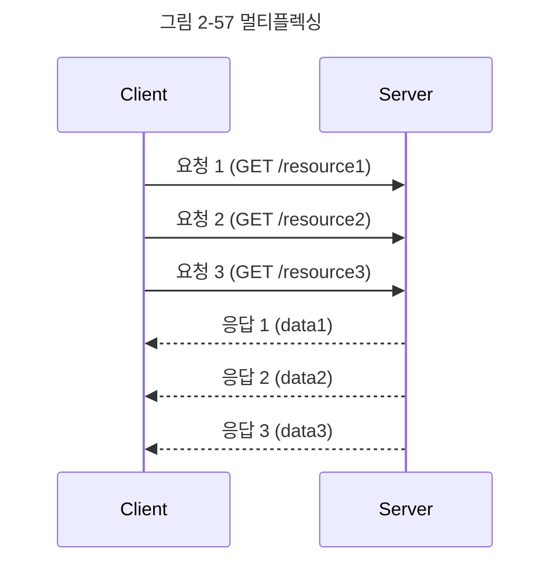

# 02-17. HTTP/2
HTTP/2는 SPDY 프로토콜에서 파생된 HTTP/1.x 보다 지연 시간을 줄이고 응답 시간을 더 빠르게 할 수 있으며 멀티플렉싱, 헤더 압축, 서버 푸시, 요청의 우선순위 처리를 지원하는 프로토콜이다.

## 멀티플렉싱
멀티플렉싱이란 여러 개의 스트림을 사용하여 송수신한다는 것이다. 이를 통해 특정 스트림의 패킷이 손실되었다고 하더라도 해당 스트림에만 영향을 미치고 나머지 스트림은 멀쩡하게 동작할 수 있다.

**스트림**\
시간이 지남에 따라 사용할 수 있게 되는 일련의 데이터 요소를 가리키는 데이터 흐름

앞의 그림은 하나의 연결 내 여러 스트림을 캡쳐한 모습니다. 병렬적인 스트림들을 통해 데이터를 서빙하고 있다. 또한, 스트림 내의 데이터들도 쪼개져 있다. 애프리케이션에서 받아온 메시지를 독립된 프레임으로 조각내어 서로 송수신한 이후 다시 조립하며 데이터를 주고받는다.

이를 통해 단일 연결을 사용하여 병렬로 여러 요청을 받을 수 있고 응답을 줄 수 있다. 이렇게 되면 HTTP/1.x에서 발생하는 문제인 HOL Blocking을 해결할 수 있다.

## 헤더 압축
HTTP/1.x 에는 크기가 큰 헤더라는 문제가 있었다.

이를 HTTP/2에서는 헤더 압축을 써서 해결하는데, 허프만 코딩 압축 알고리즘을 사용하는 HPACK 압축 형식을 가진다.

### 허프만 코딩
허프만 코딩은 문자열을 문자 단위로 쪼개 빈도수를 세어 빈도가 높은 정보는 적은 비트 수를 사용하여 표현하고, 빈도가 낮은 정보는 비트 수를 많이 사용하여 표현해서 전체 데이터의 표현에 필요한 비트양을 줄이는 원리이다.

## 서버 푸시
HTTP/1.1 에서는 클라이언트가 서버에 요청을 해야 파일을 다운로드받을 수 있었다면, 