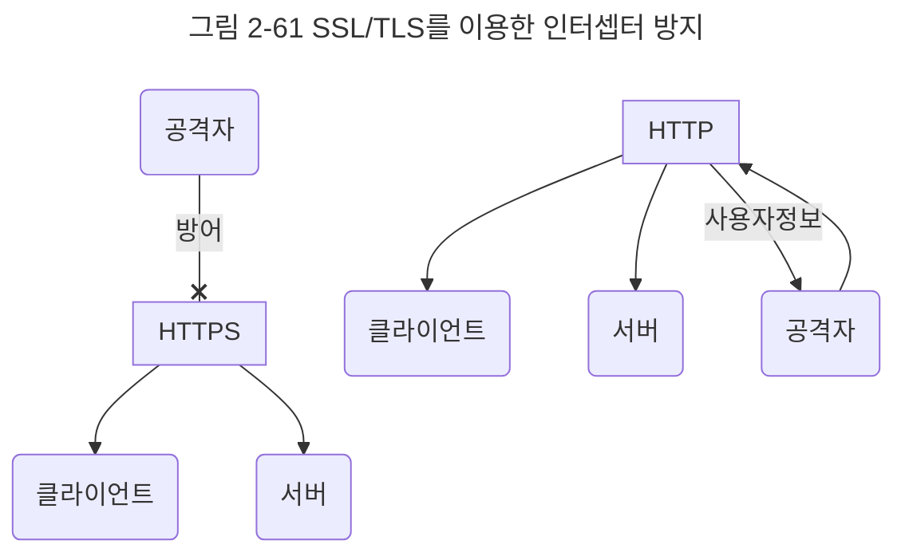
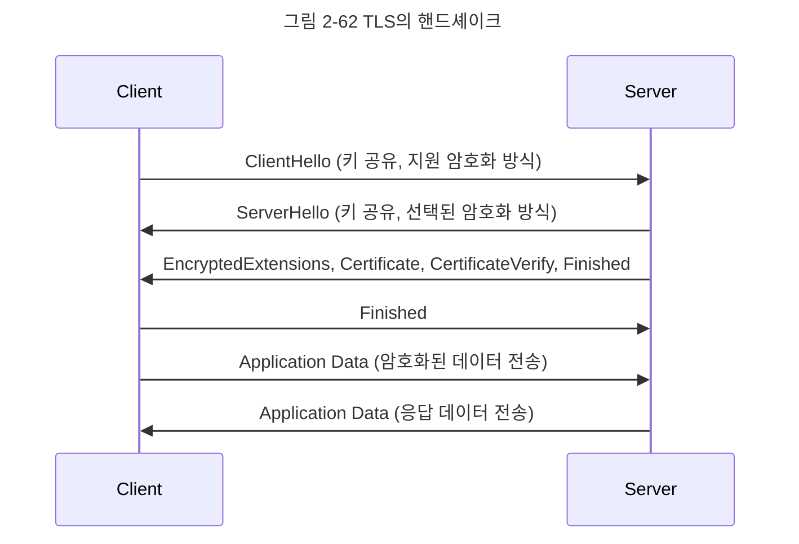

# 02-18. HTTPS
HTTPS/2는 HTTPS 위에서 동작한다. HTTPS는 애플리케이션 계층과 전송 계층 사이에 신뢰 계층인 SSL/TLS 계층을 넣은 신뢰할 수 있는 HTTP 요청을 말한다. 이를 통해 '통신을 암호화'한다.

## SSL/TLS
SSL(Secure Socket Layer)은 SSL 1.0부터 시작해서 SSL 2.0, SSL 3.0, TLS(Transport Layer Security Protocol) 1.0, TLS 1.3까지 버전이 올라가며 마지막으로 TLS로 명칭이 변경되었으나, 보통 이를 합쳐 SSL/TLS로 많이 부른다. 

SSL/TLS은 전송 계층에서 보안을 제공하는 프로토콜이다. 클라이언트와 서버가 통신할 때 SSL/TLS를 통해 제3자가 메시지를 도청하거나 변조하지 못하도록 한다.



앞의 그림처럼 SSL/TLS를 통해 공격자가 서버인 척하며 사용자 정보를 가로채는 네트워크상의 '인터셉터'를 방지할 수 있다.

SSL/TLS는 보안 세션을 기반으로 데이터를 암호화하며 보안 세션이 만들어질 때 인증 메커니즘, 키 교환 암호화 알고리즘, 해싱 알고리즘이 사용된다.

### 보안 세션
보안 세션이란 보안이 시작되고 끝나는 동안 유지되는 세션을 말하고, SSL/TLS는 핸드셰이크를 통해 보안 세션을 생성하고 이를 기반으로 상태 정보 등을 공유한다.

**세션**\
운영체제가 어떠한 사용자로부터 자신의 자산 이용을 허락하는 일정한 기간을 뜻한다. 즉, 사용자는 일정 시간 동안 응용 프로그램, 자원 등을 사용할 수 있다.


클라이언트와 서버가 키를 공유하고 이를 기반으로 인증, 인증 확인 등의 작업이 일어나는 단 한 번의 1-RTT가 생긴 후 데이터를 송수신하는 것을 볼 수 있다.

클라이언트에서 사이퍼 슈트를 서버에 전달하면 서버는 받은 사이퍼 슈트의 암호화 알고리즘 리스트를 제공할 수 있는지 확인한다. 제공할 수 있다면 서버에서 클라이언트로 인증서를 보내는 인증 메커니즘이 시작되고 이후 해싱 알로리즘 등으로 암호화된 데이터의 송수신이 시작된다.

#### 사이퍼 슈트
사이퍼 슈트는 프로토콜, AEAD 사이퍼 모드, 해싱 알고리즘이 나열된 규약을 말하며, 다섯 개가 있다.

| 사이퍼 슈트 | 프로토콜 |AEAD 사이퍼 모드 | 해싱 알고리즘 |
|---|---|---|---|
|TLS_AES_128_GCM_SHA256|TLS 1.3|AES-GCM 128-bit|SHA-256|
|TLS_AES_256_GCM_SHA384|TLS 1.3|AES-GCM 256-bit|SHA-384|
|TLS_CHACHA20_POLY1305_SHA256|TLS 1.3|ChaCha20-Poly1305|SHA-256|
|TLS_AES_128_CCM_SHA256|TLS 1.3|AES-CCM 128-bit|SHA-256|
|TLS_AES_128_CCM_8_SHA256|TLS 1.3|AES-CCM-8 128-bit|SHA-256|

예를 들어 `TLS_AES_128_GCM_SHA256`에는 세 가지 규약이 들어 있는데 `TLS`는 프로토콜, `AES_128_GCM`은 AEAD 사이퍼 모드, `SHA256`은 해싱 알고리즘을 뜻한다.

#### AEAD 사이퍼 모드
AEAD(Authenticated Encryption with Associated Date)는 데이터 암호화 알고리즘이며 AES_128_GCM 등이 있다. 예를 들어 AES_128_GCM이라는 것은 128비트의 키를 사용하는 표준 블록 암호화 기술과 병렬 계산이 용이한 암호화 알고리즘 GCM이 결합된 알고리즘을 뜻한다.

### 인증 메커니즘
인증 메커니즘은 CA(Certificate Authroities)에서 발급한 인증서를 기반으로 이루어진다. CA에서 발급한 인증서는 안전한 연결을 시작하는 데 있어 필요한 '공개키'를 클라이언트에 제공하고 사용자가 접속한 '서버가 신뢰'할 수 있는 서버임을 보장한다. 인증서는 서비스 정보, 공개키, 지문, 디지털 서명 등으로 이루어져 있다.

참고로 CA는 아무 기업이나 할 수 있는 것이 아니고 신뢰성이 엄격하게 공인된 기업들만 참여할 수 있으며, 대표적인 기업으로는 Comodo, GoDaddy, GlobalSign, 아마존 등이 있다.

#### CA 발급 과정
자신의 서비스가 CA 인증서를 발급받으려면 자신의 사이트 정보와 공개키를 CA에 제출해야 한다. 이후 CA는 공개키를 해시한 값인 지문을 사용하는 CA의 비밀키 등을 기반으로 CA 인증서를 발급한다.

**개인키**\
비밀키라고도 하며, 개인이 소유하고 있는 키이자 반드시 자신만이 소유해야 하는 키

**공개키**\
공개되어 있는 키

### 암호화 알고리즘
키 교환 암호화 알고리즘으로는 대수곡선 기반의 ECDHE 또는 모듈식 기반의 DHE를 사용한다. 둘 다 디피-헬만 방식을 근간으로 만들어졌다.

#### 디피-헬만 키 교환 암호화 알고리즘
디피-헬만 키 교환 암호화 알고리즘은 암호키를 교환하는 하나의 방법이다.

$$y = g^x mod p$$

앞의 식에서 g와 x와 p를 안다면 y는 구하기 쉽지만 g와 y와 p만 안다면 x를 구하기는 어렵다는 원리에 기반한 알고리즘이다.

처음에 공개 값을 공유하고 각자의 비밀 값과 혼합한 후 혼합 값을 공유한다. 그다음 각자의 비밀 값과 또 혼합한다. 그 이후에 공통의 암호키가 생성된다.

이렇게 클라이언트와 서버 모두 개인키와 공개키를 생성하고 서로에게 공개키를 보내고 공개키와 개인키를 결합하여 PSK(사전 합의된 비밀키)가 생성된다면, 악의적인 공격자가 개인키 도는 공개키를 가지고도 PSK가 없기 때문에 아무것도 할 수 없다. 이를 통해 키를 암호화할 수 있따.

### 해싱 알고리즘
해싱 알고리즘은 데이터를 추정하기 힘든 더 작고, 섞여 있는 조각으로 만드는 알고리즘이다. SSL/TLS는 해싱 알고리즘으로 SHA-256 알고리즘과 SHA-384 알고리즘을 쓰며, 그중 많이 쓰는 SHA-256 알고리즘을 설명한다.

#### SHA-256 알고리즘
SHA-256 알고리즘은 해시 함수의 결괏값이 256비트인 알고리즘이며 비트 코인을 비롯한 많은 블록체인 시스템에서도 쓴다. SHA-256 알고리즘은 해싱을 해야 할 메시지에 1을 추가하는 등 전처리를 하고 전처리된 메시지를 기반으로 해시를 반환한다.

**해시**\
다양한 길이를 가진 데이터를 고정된 길이를 가진 데이터로 매핑한 값

**해싱**\
임의의 데이터를 해시로 바꿔주는 일이며 해시 함수가 이를 담당

**해시 함수**\
임의의 데이터를 입력으로 받아 일정한 길이의 데이터로 바꿔주는 함수

참고로 TLS 1.3은 사용자가 이전에 방문한 사이트로 다시 방문한다면 SSL/TLS에서 보안 세션을 만들 때 걸리는 통신을 하지 않아도 된다. 이를 0-RTT라고 한다.

## SEO에도 도움이 되는 HTTPS
구글은 SSL 인증서를 강조해왔고 사이트 내 모든 요소가 동일하다면 HTTPS 서비스를 하는 사이트가 그렇지 않은 사이트보다 SEO 순위가 높을 것이라고 공식적으로 밝혔다.

SEO(Search Engine Optimization)는 검색엔진 최적화를 뜻하며 사용자들이 구글, 네이버 같은 검색엔진으로 웹 사이트를 검색했을 때 그 결과를 페이지 상단에 노출시켜 많은 사람이 볼 수 있도록 최적화하는 방법을 의미한다. 서비스를 운영한다면 SEO 관리는 필수이다. 내가 만든 사이트에 많은 사람이 유입되면 좋다. 이를 위한 방법으로 캐노니컬 설정, 메타 설정, 페이지 속도 개선, 사이트맵 관리 등이 있다.

### 캐노니컬 설정
```html
<link rel="canonical" href="http://example.com/page2.php" />
```
앞처럼 사이트 link에 캐노니컬을 설정해야 한다.

### 메타설정
html 파일의 가장 윗부분인 메타를 잘 설정해야 한다.

### 페이지 속도 개선
사이트의 속도는 빨라야 한다. 예를 들어 내가 서비스를 운용하는데, 서비스에 접속하는 데 10초가 걸리면 사용자가 서비스를 이용하지 않을 것이다. 페이지의 속도는 빨라야 한다. 구글의 PageSpeedInsights로 가서 자신의 서비스에 대한 리포팅을 주기적으로 받으며 관리해야 한다.

### 사이트맵 관리
사이트맵을 정기적으로 관리하는 것은 필수이다. 사이트맵 제너레이터를 사용하거나 직접 코드를 만들어 구축해도 된다. 사이트맵은 다음과 같은 형식의 xml 파일을 말한다.

```xml
<?xml version="1.0" encoding="utf-8"?>
<urlset xmlns="http://www.sitemaps.org/schemas/sitemap/0.9">
<url>
<log>http://example.co.kr</loc>
<lastmod>수정날짜</lastmod>
<changefreq>daily</changefreq>
<priority>1.1</priority>
</url>
</urlset>
```

## HTTPS 구축 방법
HTTPS 구축 방법은 크게 세 가지이다. 직접 CA에서 구매한 인증키를 기반으로 HTTPS 서비스를 구축하거나, 서버 앞단의 HTTPS를 제공하는 로드밸런서를 두거나, 서버 앞단에 HTTPS를 제공하는 CDN을 둬서 구축한다.