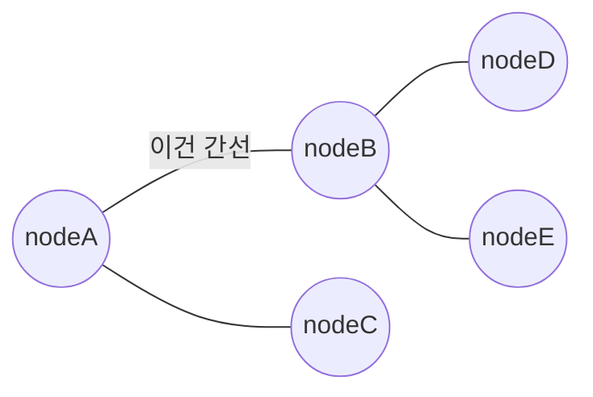
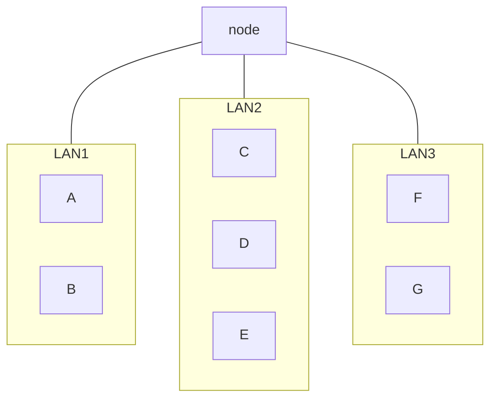

# 네트워크 거시적으로 살펴보기 - 1

이번 절에서는 네트워크의 큰 구조를 살펴보겠습니다. 네트워크란 여러 장치가 서로 연결되어 정보를 주고받을 수 있는 통신망이라고 했지요? 이 모양은 그래프의 형태를 띄고 있습니다. 그래프란 다음 그림처럼 노드와 노드를 연결하는 간선으로 이루어진 자료 구조입니다. 여기서 자료구조란 정보를 표현하고 다루는 방법을 의미합니다.

노드는 정점(vertex), 간선은 링크(link)라고도 부릅니다.

## 네트워크의 기본 구조
모든 네트워크는 '노드', 노드를 연결하는 '간선', 노드 간 주고받는 '메시지'로 구성됩니다. 노드는 정보를 주고받을 수 있는 장치, 간선은 정보를 주고받을 수 있는 유무선의 통신 매체라고 이해하면 쉽습니다. 각 개념들을 좀 더 세부적으로 살펴보겠습니다.

### 호스트
네트워크의 가장자리에 위치한 노드는 네트워크를 통해 흐르는 정보를 최초로 생성 및 송신하고, 최종적으로 수신합니다. 이는 서버 컴퓨터가 될 수도 있고, 개인 데스트톱, 노트북, 스마트폰이 될 수도 있습니다. 요즘은 종류가 더 다양해져 시계, 자동차, 냉장고, TV 등이 될 수도 있습니다. 우리가 일상에서 사용하는 네트워크 기기 대부분이 여기에 속한다고 봐도 무방합니다. 이러한 가장자리 노드를 네트워크에서는 호스트라고 부릅니다. 호스트는 네트워크의 가장자리에 자리 잡고 있다는 점에서 종단 시스템이라고도 합니다.

때로는 호스트가 네트워크상에서 특정한 역할을 수행하기도 하는데, 대표적인 역할로는 서버와 클라이언트가 있습니다.

서버는 '어떠한 서비스'를 제공하는 호스트입니다. 여기서 '어떠한 서비스'는 파일이 될 수도(파일 서버), 웹 페이지가 될 수도(웹 서버), 메일이 될 수도(메일 서버) 있습니다. 서버라는 용어는 서브(serve: 제공하다)에서 비롯되었습니다. 식당에서는 종업원이 손님에게 음식을 서빙하지요? 이러한 종업원 역할을 하는 호스트가 바로 서버입니다.

반면 클라이언트란 서버에게 어떠한 서비스를 요청하고 서버의 응답을 제공받는 호스트입니다. 식당에서 종업원에게 서빙을 받으려면 손님이 먼저 요청해야 하죠. 손님이 종업원에게 음식을 요청하면 종업원은 그 음식을 서빙합니다. 이처럼 클라이언트는 서버에게 요청을 보내고 그에 대한 응답을 제공받습니다.

예를 들어서 여러분이 노트북에서 웹 브라우저를 열고 구글 웹 페이지에 접속을 시도했다고 해 봅시다. 그럼 구글의 서버는 해당 요청을 받고, 그 요청에 맞는 웹 페이지를 여러분의 웹 브라우저에 전달합니다. 여기서 여러분의 노트북은 클라이언트로서 구글 서버에 웹 페이지를 요청하고, 그에 대한 응답을 제공받은 셈입니다.

### 네트워크 장비
네트워크 노드가 호스트만 있는 것은 아닙니다. 네트워크 가장자리에 위치하지 않은 노드, 즉 호스트간 주고받을 정보가 중간에 거치는 노드도 있습니다. 이를 중간 노드라고 하는데요, 대표적으로 앞으로 학습할 이더넷 허브, 스위치, 라우터, 공유기 등이 있습니다. 이 책에서는 이러한 중간 노드들을 네트워크 장비라 통칭하겠습니다. 네트워크 장비는 호스트 간 주고받는 정보가 원하는 수신지까지 안정적이고 안전하게 전송될 수 있도록 합니다.

### 호스트, 네트워크 장비, 서버, 클라이언트는 완전히 배타적인 개념일까요?
앞서 네트워크 노드의 종류로 호스트와 네트워크 장비에 관해 설명했는데요, 유의할 점은 이와 같은 개념들은 그저 노드의 역할에 따라 구분한 기준에 불과하다는 것입니다. 오늘날 네트워크에서는 이와 같은 개념들이 칼로 자르듯 명확하게 구분되지 않습니다.

호스트 또는 네트워크 장비로서의 역할만을 수행할 수 있는 노드가 있는 반면, 그 모든 역할을 수행할 수 있는 노드도 존재합니다. 일반적으로 호스트로 간주되는 여러분의 컴퓨터도 네트워크 장비 역할을 수행할 수 있습니다.

서버와 클라이언트의 개념도 마찬가지입니다. 단적인 예시로 여러분의 컴퓨터는 웹 브라우저를 통해 클라이언트로서 네트워크에 참여할 수 있지만 동시에 간단한 프로그램 설치와 설정을 통해 얼마든지 웹 서버로 사용할 수도 있습니다.

요컨대 다음과 같이 생각하지 않기를 바랍니다.

- 호스트와 네트워크 장비는 완전히 배타적인 개념이다.
- 서버와 클라이언트는 완전히 배타적인 개념이다.

어디까지나 일반적인 관점으로 다음과 같이 기억해 주세요.

- 호스트 역할을 수행할 수 있는 노드, 네트워크 장비 역할을 수행할 수 있는 노드가 있다.
- 서버 역할을 수행할 수 있는 노드, 클라이언트 역할을 수행할 수 있는 노드가 있다.

### 통신 매체
그래프는 노드와 이를 연결 짓는 간선(링크)으로 이루어지기에, 호스트와 네트워크 장비 또한 유무선 매체를 통해 연결되어 있어야 합니다. 이렇게 각 노드를 연결하는 간선이 바로 통신 매체입니다. 이 통신 매체에는 노드들을 유선으로 연결하는 유선 매체, 무선으로 연결하는 무선 매체가 있습니다.

### 메시지
통신 매체로 연결되는 노드가 주고받는 정보를 메시지라고 합니다. 메시지는 웹 페이지가 될 수도, 파일이 될 수도, 메일이 될 수도 있습니다. 요컨대, 네트워크는 가장자리 노드인 호스트, 중간 노드인 네트워크 장비, 노드들을 연결하는 간선인 통신 매체, 노드들이 주고받는 정보인 메시지로 구성됩니다.

## 범위에 따른 네트워크 분류
지금까지 네트워크를 구성하는 요소들을 학습해 보았습니다. 이제 이 요소들이 모이고 모여 네트워크를 형성했다고 가정해 보겠습니다. 그렇게 형성된 네트워크의 범위는 어느 정도일까요? 호스트가 메시지를 주고받는 범위는 일반 가정이 될 수도 있고, 기업이 될 수도 있으며, 때로는 도시나 국가가 될 수도 있습니다. 즉, 네트워크 구성 범위는 다양합니다.

네트워크의 구성 범위가 다양한 만큼, 네트워크를 범위에 따라 분류하는 기준도 존재합니다. 네트워크는 범위에 따라 크게 LAN과 WAN으로 구분합니다. LAN 부터 하나씩 살펴보겠습니다.

### LAN
LAN은 Local Area Network의 약자로 이름 그대로 가까운 지역을 연결한 근거리 통신망을 의미합니다. 예를 들어서 가정, 기업, 학교처럼 한정된 공간에서의 네트워크를 LAN이라고 부릅니다. 다음 그림을 통해서 이해해 보세요.

- A, B : 일반 가정
- C, D, E : 특정 회사
- F, G : 다른 국가의 가정

이때 A와 B 그리고 F 와 G는 각각 가정이라는 한정된 공간에 구성된 네트워크이며, C, D, E 또한 회사라는 한정된 공간에 구성된 네트워크이므로 세 집합 모두 LAN이라고 볼 수 있습니다.

### WAN
WAN은 Wide Area Network의 약자로 이름 그대로 먼 지역을 연결하는 광역 통신망을 의미합니다. 멀리 떨어진 LAN을 연결할 수 있는 네트워크가 바로 WAN입니다. 앞서 인터넷은 '네트워크의 네트워크'라고 설명했지요? 인터넷이 WAN으로 분류됩니다. 같은 LAN에 속한 호스트끼리 메시지를 주고받아야 할 때는 인터넷 연결과 같은 WAN이 필요 없지만, 다른 LAN에 속한 호스트와 메시지를 주고받아야 할 때는 WAN이 필요합니다.

여러분이 인터넷을 사용하기 위해 접속하는 WAN은 ISP라는 인터넷 서비스 업체가 구축하고 관리합니다. ISP는 사용자에게 인터넷과 같은 WAN에 연결 가능한 회선을 임대하는 등 WAN과 관련한 다양한 서비스를 제공합니다. 인터넷을 사용하기 위해 ISP와 계약하여 인터넷 사용 요금을 내는 것이 이러한 이유 때문입니다. 국내의  대표적인 ISP에는 KT, LG유플러스, SK브로드밴드가 있습니다.

참고로 인터넷이 WAN의 전부는 아닙니다. 멀리 떨어진 LAN을 연결하기 위해 특정 조직에서 블특정 다수에게 공개되지 않은 WAN을 얼마든지 구축할 수도 있습니다.

### CAN과 MAN
앞서 네트워크를 범위에 따라 LAN과 WAN 두 종류로 나누어 설명했지만, 더 세밀하게 나누는 경우도 있습니다. LAN보다는 넓고 WAN 보다는 좁은 범위의 대표적인 네트워크로 CAN와 MAN이 있습니다.

CAN(Campus Area Network)은 학교, 회사의 여러 건물 단위로 연결되는 규모의 네트워크를 의미하고, MAN(Metropolitan Area Network)은 도시나 대도시 단위로 연결되는 규모의 네트워크를 의미합니다. 네트워크의 범위를 기준으로 분류하면 WAN, MAN, CAN, LAN 순으로 작아진다고 볼 수 있습니다.
