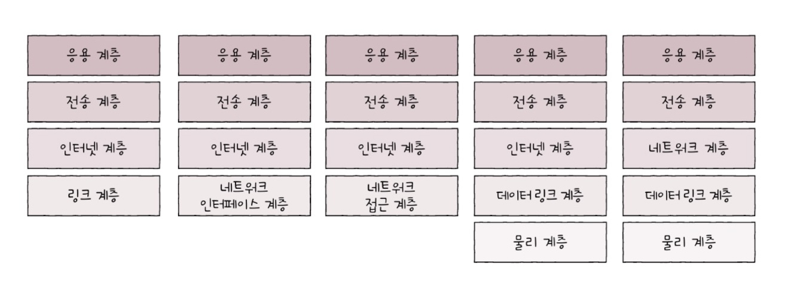

# 좀 더 알아보기 - 1
## OSI 7 계층, TCP/IP 4계층은 사실 아무것도 해 주지 않는다
네트워크 참조 모델을 처음 학습하면 네트워크 참조 모델은 반드시 지켜져야 하는 규칙이며, 모든 프로토콜이나 네트워크 장비는 네트워크 참조 모델에 근거해 반드시 특정 계층에 완벽히 대응될 것이라 오해할 수 있지만, 그렇지 않습니다.

네트워크 참조 모델은 모든 프로토콜과 네트워크 장비가 반드시 지켜야 하는 엄격한 규칙이나 법규가 아닙니다. 앞서도 말한 것처럼 마치 가이드라인과 같지요. 네트워크 참조 모델은 분명 중요한 개념이지만, 네트워크 '참조' 모델이라는 이름처럼 네트워크 구조에 대한 개념 참조를 위해 사용하는 것이 바람직합니다.

지금도 새로운 프로토콜과 네트워크 장비는 만들어지고 있고, 모든 프로토콜이 모든 모델의 특정 게층에 완벽히 대응되지는 않습니다. 그래서 특정 계층으로 명확히 분류되는 프로토콜이나 네트워크 장비도 물론 다수 있지만, 특정 계층으로 분류하기 어렵거나 여러 계층을 포괄하는 프로토콜이나 네트워크 장비도 얼마든지 있을 수 있습니다.

네트워크 참조 모델이나 특정 계층은 네트워크를 작동시키는 주체가 아닙니다. 프로토콜 혹은 네트워크 장비 같은 참조 모델에 속한 대상이 바로 네트워크를 작동시키는 주체이자 '무언가를 해 주는' 대상입니다. 즉, 네트워크 참조 모델과 계층은 통신이 일어나는 단계를 역할별로 구획한 큰 그림, 이른바 '모델'일 뿐이지 반드시 지켜야 할 '규칙'도, 네트워크의 작동 주체도 아닙니다.

단적인 예로 같은 TCP/IP 모델을 서술함에 있어서도 공식 문서, 전공 서적마다 계층별 명칭과 구성, 계층 수를 다음 그림과 같이 비교적 자유롭게 서술하곤 합니다. 네트워크 참조 모델을 엄격한 규칙이나 법규로 간주한다면 다음과 같은 서술을 접하거나 특정 계층으로 분류하기 어려운 프로토콜/네트워크 장비를 만날 때 혼란스러울 수 있습니다.

OSI 모델과 TCP/IP 모델 간의 비교도 마찬가지입니다. 앞서 TCP/IP 모델의 서술에서 '유사하다'라는 다소 애매한 표현을 사용한 이유가 있습니다. '유사하다'라는 표현이 가장 정확한 표현이기 때문입니다. OSI 모델의 목적은 이론적 설계를 위한 참조에 가깝고, TCP/IP 모델의 목적은 실용적 구현을 위한 참조에 가깝습니다. 즉, 두 모델은 별개의 목적을 가진 별개의 모델입니다.

그래서 사실 두 모델 계층 간의 직접적인 비교는 기술적으로 엄밀하지 않습니다. 이는 마치 한 자동차 회사의 이상적인 자동차 설게도와 다른 자동차 회사의 실제 출시된 자동차를 비교하는 것과 같지요. 요컨대 OSI 모델과 TCP/IP 모델은 분명 네트워크를 이해하는 데 매우 유용하고 중요한 개념이지만, 모든 네트워크 프로토콜과 장비들이 이 모델 계층에 예외 없이 부합하리라 속단하는 것은 오해입니다.