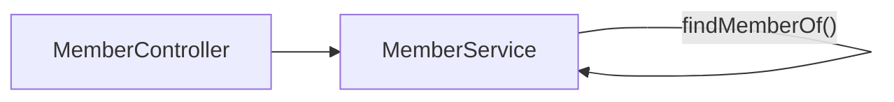

(팀원이 만들어준 회고 타이틀 이미지 👍)

계획에 없던 회고글이지만 기왕 작성한 만큼 기록해봅니다.

싸피 2학기 공통 프로젝트를 완료했습니다. 얼굴 데이터 라벨링 툴 즈믄누리를 제작하고 작성한 회고입니다.

## 팀워크

길고 지루한 기술적인 이야기로 넘어가기 전에 팀워크를 이야기해보려고 합니다. 개인적으로 이번 프로젝트는 꽤나 의미가 있습니다. 작년 퇴사후 약 1년간 혼자 공부하는 시간을 가지면서 제 코드 스타일을 만들었습니다. 그리고 그 스타일을 이번 프로젝트에 적용하는 기회가 되었습니다.

제 고집이 90%, 팀원들의 신뢰 10%로 감사하게도 백엔드 팀장이라는 꽤나 권위적인 역할을 맡아 프로젝트를 진행했습니다. 그래서 제 독단으로 제 스타일을 강제하는 작업이 원활하게 진행되었습니다.

그래서 제가 어떻게 독단을 부렸는지 간략하게 이야기해보려 합니다.

제 욕심으로 즈믄누리는 공통된 구조를 백엔드팀 모두가 가져가도록 해야했습니다. 그러나 팀원들이 작업하는 내용을 제가 모두 확인할 수는 없으므로 제가 기대하는 수준의 코드가 나올 수 있도록 보조할 필요가 있었습니다.

그래서 2가지 작업을 진행했습니다.

1. 표본 코드 작성하기
2. 코드 리뷰

### 표본 코드 작성하기

즈믄누리를 진행하면서 가장 도움이 된 작업입니다. 도메인 중 하나의 컨트롤러, 서비스, 엔티티, 레포지토리를 모두 작업하여 커밋합니다. 그리고 제가 작업한 내용을 참조하도록 팀원들에게 전달했습니다.

먼저 작업한 내용 덕분에 팀원의 코드를 보기 전에도 어떤 구조일지 예상이 되어 코드 리뷰, 디버깅이 수월했습니다.

그리고 이건 제가 예상하지 못한 부분인데요. 코드 작성에 AI를 많이 사용했습니다. 특히 인텔리제이의 Junie를 많이 사용했습니다. 제가 먼저 작성하는 코드를 보고서 제 스타일에 맞춰 작성해준 결과물을 보고 놀라웠던 경험이 있습니다. 그래서 AI 도구를 더 열심히 사용했습니다.

### 코드 리뷰

견본이 되는 코드 스타일이 있다지만 그럼에도 팀원들의 코드를 디테일하게 리뷰할 필요가 있었습니다.

이유는 아래와 같습니다.

1. 스타일에 맞지 않을 경우 그렇게 해야만 했던 이유를 듣고 제가 수긍하기 위해서
2. 스타일에 맞지 않는 코드 작성에 별다른 이유가 없을 경우 왜 그렇게 작성했는지 제가 설득 당하기 위해서
3. 만약 설득되지 않았다면 왜 이렇게 하면 안 되는지 설명해주기 위해서
4. 그 외 눈에 보이지 않는, 암묵지(노하우)가 필요할 경우 공유를 위해서

위와 같은 이유로 인해서 세세한 부분까지 피드백을 하며 코드 스타일을 맞추는데 시간을 많이 투자하였습니다. 물론 초반 시간 소요가 많았습니다. 초기에는 엔티티 하나 작성하는 작업에도 하루 이상이 걸리기도 했습니다.

이런 노력으로 얻게된 결과는 아래와 같습니다.

1. 표본 코드와 코드 리뷰라는 투자 덕분에 통일된 프로젝트 구조와 코드를 확보할 수 있었습니다.
2. 코드 시인성을 높일 수 있었고, 프로젝트 후반부에도 빠른 시간 내에 이슈 대응과 기능 추가가 가능했습니다.
3. 대부분의 이슈를 지라 3포인트 수준의 작은 수준의 작업으로 처리할 수 있었습니다.

## 기술

## DDD

가장 먼저 떠오르는 특징은 DDD입니다. 도메인 드리븐 디자인, 도메인 패턴이라고 부르는 구조입니다. 서비스에서는 오케스트레이션만 맡고 비즈니스로직은 엔티티 객체, 또는 리졸버, 핸들러에서 처리하는 패턴입니다.

도메인에서 주요 로직을 처리하도록 설계를 하면 코드 읽기가 상당히 수월해집니다. 잘만 만들면 평문 읽듯이 코드를 설계할 수 있죠.

```java
// 일반
var member = new Member();
member.status = MemberStatus.ACTIVE;
if(member.status == MemberStatus.ACTIVE) {...}

// ddd
var member = new Member();
member.activate();
if(member.activated()) {...}
```

위 코드에서 보이듯이 코드가 좀 더 일반 줄글처럼 보이게 개선되었습니다.

## 커스텀 애너테이션

다음으로는 커스텀애너테이션 도입입니다. 애너테이션 적용 결과를 보기 전에 어떻게 발전되어 왔는지 먼저 설명하겠습니다.

어느 정도 작업이 진행된 이후 살펴본 서비스 코드 상태는 대략 아래와 같았습니다.

```java
public class MemberService {

	private final MemberRepository memberRepository;

	public void method1(int memberId) {
		var member = memberRepository.findById(memberId).orElseThrow();
		// ... logic
	}
	
	public void method2(int memberId) {
		var member = memberRepository.findById(memberId).orElseThrow();
		// ... logic
	}
	
	public void method3(int memberId) {
		var member = memberRepository.findById(memberId).orElseThrow();
		// ... logic
	}
}
```

메서드에서 동일한 로직이 계속해서 반복됩니다. 그래서 1차 리팩토링을 진행하여 아래와 같은 구조가 되었습니다.

```java
public class MemberService {

	private final MemberRepository memberRepository;

	public void method1(int memberId) {
		var member = findMemberOf(memberId);
		// ... logic
	}
	
	public void method2(int memberId) {
		var member = findMemberOf(memberId);
		// ... logic
	}
	
	public void method3(int memberId) {
		var member = findMemberOf(memberId);
		// ... logic
	}
	
	private Member findMemberOf(int memberId) {
		// 공통 로직을 메서드로 분리
		return memberRepository.findById(memberId).orElseThrow();
	}
}
```

멤버Id에 해당하는 멤버를 찾는 로직을 프라이빗으로 갖도록 리팩토링하여 한곳에서 공통 로직을 처리하게 개선되었습니다. 그런데 이게 정말 좋은 코드인가? 라고 질문한다면 저는 아니라고 대답하겠습니다.

이 코드가 안 좋은 이유는 2가지 정도가 떠오릅니다.

1. 프라이빗 메서드는 테스트코드 작성이 어렵다.
2. 자기가 자신을 참조하는 클래스 동작이 객체지향적이지 않다.

### 프라이빗 메서드는 테스트코드 작성이 어렵다.

차례로 살펴봅시다.

1. 프라이빗 메서드는 테스트코드 작성이 어렵다.

```java
@SpringBootTest
public class MemberServiceTest {

	@Autowired
	MemberRepository memberRepository;
	
	@Test
	void method1Test() {
		// logic
	}
	
	@Test
	@Disabled
	void findMemberOfTest() {
		// logic
	}
}
```

코드를 보시면 멤버 서비스에 있던 메서드는 테스트를 잘 작성할 수 있습니다. 그런데 `findMemberOf()` 메서드는 프라이빗 메서드이기 때문에 테스트코드 작성이 불가능합니다.

리플렉션을 사용해 억지로 테스트를 진행할 수는 있겠습니다만… 그렇게까지 해야할까요?

여기 예시는 단순한 기능이기 때문에 테스트가 필요 없다고도 생각할 수 있습니다. 그러나 공통으로 사용되는 복잡한 메서드가 프라이빗인 경우라고 생각한다면 지금 상황은 유쾌하지 않습니다.

### 자기가 자신을 참조하는 클래스 동작이 객체지향적이지 않다.

다음입니다.

1. 자기가 자신을 참조하는 클래스 동작이 객체지향적이지 않다.

(이 부분은 지극히 개인적인 취향이 반영된 내용입니다)

일단 로직 플로우를 살펴보죠.



멤버서비스에서 계속해서 자기 참조가 일어나는 구조입니다. 서비스 내부에서 자기 자신을 반복적으로 호출하는 패턴은 ‘서비스가 스스로를 유틸 클래스처럼 사용하는’ 모습입니다. 이는 단일 책임 원칙을 생각할 때 어색합니다. 지금은 프라이빗 메서드가 하나 뿐이고 단순한 로직입니다만,,, 로직이 길고 복잡해 진다면? 프라이빗 메서드가 계속해서 늘어난다면? 이런 고민에 벌써 머리가 아파옵니다.

그래서 애초에 컨트롤러에서 서비스 계층이 사용하는 객체를 바로 주입하도록 스프링 기능을 사용했습니다.

```java
public class MemberController {

	private final MemberService memberService;
	
	@PostMapping
	public Response method1(@TargetMember Member member) {
			memberService.method1(member);
			// logic...
	}
}
```

위와같이 컨트롤러에서 서비스에 타겟 객체를 주입해줍니다. 이 동작이 어떻게 동작하냐구요? 아래와 같이 애너테이션과 핸들러를 구현, 장착했습니다.

```java
@Target(ElementType.PARAMETER)
@Retention(RetentionPolicy.RUNTIME)
@Documented
public @interface TargetMember {
}
```

리졸버 동작을 표시해둘 애너테이션을 제작합니다. 표시만 해두는 역할이기 때문에 별다른 내용은 없습니다.

```java
@Component
@RequiredArgsConstructor
public class TargetMemberArgumentResolver implements HandlerMethodArgumentResolver {

    private final MemberService memberService;
    
    @Override
    public boolean supportsParameter(MethodParameter parameter) {...}
    
    @Override
    public Object resolveArgument(MethodParameter parameter,
                                  ModelAndViewContainer mavContainer,
                                  NativeWebRequest webRequest,
                                  WebDataBinderFactory binderFactory
    ) throws Exception {...}

}
```

다음으로 원하는 동작을 처리할 리졸버을 제작합니다. 내용상 전체 코드는 첨부하지 못했지만 핸들러메서드아규먼트리졸버를 구현하는 커스텀 리졸버를 제작하면됩니다.

```java
@Configuration
@RequiredArgsConstructor
public class ResolverConfig implements WebMvcConfigurer {

    private final TargetMemberArgumentResolver targetMemberArgumentResolver ;

    @Override
    public void addArgumentResolvers(List<HandlerMethodArgumentResolver> resolvers) {
        resolvers.add(targetMemberArgumentResolver );
    }
}

```

리졸버를 제작했다면 스프링에 해당 리졸버를 등록해야합니다. 등록하지 않는다면 리졸버가 동작하지 않습니다.

여기까지 해서 구현이 끝났습니다. 아래는 결과 코드입니다.

```java
public class MemberController {

	private final MemberService memberService;
	
	@GetMapping
	public Response method1(@TargetMember Member member) {
		memberService.method1(member);
		// logic...
	}
	
	@PostMapping
	public Response method1(@TargetMember Member member) {
		memberService.method1(member);
		// logic...
	}
}
```

애너테이션을 사용한 컨트롤러예시입니다.

```java
public class MemberService {

	private final MemberRepository memberRepository;

	public void method1(Member member) {
		// ... logic
	}
	
	public void method2(Member member) {
		// ... logic
	}
	
	public void method3(Member member) {
		// ... logic
	}
}
```

애너테이션으로 주입받은 멤버를 처리하는 서비스 예시입니다. 개선 전의 서비스 코드를 한 번 더 보겠습니다.

```java
public class MemberService {

	private final MemberRepository memberRepository;

	public void method1(int memberId) {
		var member = memberRepository.findById(memberId).orElseThrow();
		// ... logic
	}
	
	public void method2(int memberId) {
		var member = memberRepository.findById(memberId).orElseThrow();
		// ... logic
	}
	
	public void method3(int memberId) {
		var member = memberRepository.findById(memberId).orElseThrow();
		// ... logic

```

메서드마다 동일하게 동작하던 부분이 추출되어 코드가 더 간결해졌습니다.

### 애너테이션으로 처리하는 부분을 AOP로 작업해도 되지 않았나요?

맞습니다. AOP를 사용해서도 충분히 해당 문제를 해결할 수 있습니다. 하지만 부끄럽게도 제가 AOP를 능숙하게 다루지 못합니다. 항상 연습해야지 다짐만 하고 익숙해지지 않는 기술이네요.

다른 이유가 하나 더 있는데요. AOP를 사용하는 코드는 디버깅이 어렵다는 단점이 있습니다. AOP를 사용해서 Member 객체를 언제, 어디서 주입받는지 확인하려면 디버깅을 엄청나게 해야합니다.

그러면 커스텀애너테이션은 뭐가 좋아서 AOP 대신 사용했냐는 질문이 나오시겠죠? 네 결국은 AOP와 비슷한 동작을 합니다만은 하나 차이점이 있습니다. 바로 애너테이션을 사용한다는거죠.

AOP 처리는 ASPECT 내부에서 알아서 동작하기 때문에 컨트롤러에서 AOP 사용여부를 확인하기가 쉽지 않습니다.

하지만 커스텀 애너테이션은 말 그대로 애너테이션이 있어 이 컨트롤러가 어느곳에서 파라미터를 주입 받겠구나라는 예측이 가능합니다.

그래서 애너테이션을 사용했습니다.

## 다음에는?
공통 프로젝트를 마무리하고 이제는 특화 프로젝트를 작업할 예정입니다. 빅데이터(분산)를 특화 프로젝트 주제로해서 팀빌딩까지 완료한 상황입니다. 

DDD 구조를 작업하면서 아키텍처에 관심이 많아졌는데요. 그래서 다음 프로젝트에 유명한 아키텍처 구조를 도입해보려고 합니다. 바로 헥사고날 아키텍쳐입니다. 도입 전에 어떤 장점이 있어서 이름부터 화려한 헥사고날인지 지금 열심히 알아보고 공부하는 중입니다. 

빅데이터(분산)인 만큼 데이터 처리 로직 최적화 등을 경험하려고 합니다. 분산 처리, 비동기 처리, 다중화 등의 도메인을 기준으로 어떤 기술에 도전해볼지 탐색 중입니다.

## 정리

이번 즈믄누리는 단순한 기능 구현을 넘어 팀워크와 코드 구조, 실험적인 시도를 동시에 경험할 수 있는 시간이었습니다.

- 팀워크 측면에서는 **표본 코드와 코드 리뷰**라는 방법론으로 통일된 코드 스타일과 구조를 확보했고, 그 결과 프로젝트 후반에도 빠르고 안정적으로 이슈 대응이 가능했습니다.
- 기술 측면에서는 **DDD와 커스텀 애너테이션**을 통해 코드 가독성과 유지보수성을 높였으며, 객체지향적인 설계에 대한 제 나름의 철학을 실제 코드로 검증할 수 있었습니다.
- 특히 AI 도구(Junnie 등)를 활용하면서, 제 코드 스타일이 학습되어 생산성을 높이는 경험을 했습니다.